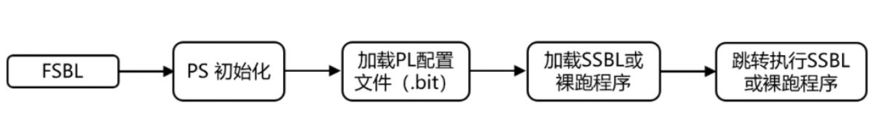

# FPGA知识点
## fpga基础知识
### FPGA资源
可编程逻辑块（CLB）

基本可编程逻辑单元是由查找表和寄存器组成的，查找表完成纯组合逻辑功能。FPGA内部寄存器可配置成触发器或锁存器。
CLB有逻辑类和存储类，由slice组成。slice是四种元素的集合，LUT，进位链，多路选择器，存储单元FF。

可编程输入输出单元（IOB）
FPGA与外界电路的接口，负责驱动和匹配不同电器特性下的输入输出信号，支持不同的IO标准。

数字时钟管理模块（DCM）
专门用于时钟综合、消除时钟偏斜和时钟相位调整，用于完成分频、倍频、相移等。


嵌入式块RAM（BRAM）
RAM可被配置为单端口RAM、双端口RAM、内容地址存储器（CAM）以及FIFO等常用存储结构。Block RAM由一定数量固定大小的存储块构成，使用BRAM不占用额外逻辑资源，并且速度快。在生成ram等存储单元的时候，应该首选block ram资源；其原因有二：第一：使用block ram等资源，可以节约更多的FF和4_LUT等底层可编写单元。使用block_ram可以说是不用白不用，最大程度发挥器件效能，节约成本的一种体现；第二：block ram是一种可以配置的硬件结构，其可靠性和速度与用LUT和register构建的存储器更有优势。
FPGA芯片内部有两种存储器资源，一种是block ram,另一种是分布式ram，由LUT配置而成。


布线资源
连通FPGA内部的所有单元，连线的长度和工艺决定着信号在连线上的驱动能力和传输速度。可划分为4类不同的类别。第一类是全局布线资源，用于芯片内部全局时钟和全局复位/置位的布线；第二类是长线资源，用以完成芯片Bank间的高速信号和第二全局时钟信号的布线；第三类是短线资源，用于完成基本逻辑单元之间的逻辑互连和布线；第四类是分布式的布线资源，用于专有时钟、复位等控制信号线。

底层内嵌功能单元
内嵌专用硬核，芯片生产商在芯片内部集成了一些专用的硬核，FPGA内部集成的专用硬件模块，如专用乘法器、串并收发器，DMA等。


### 可编程技术
闪存、反熔丝、静态存储器是现代FPGA常用的可编程技术
闪存属于EEPROM的一种，采用MOS晶体管技术，特点是在绝缘层中含有不与外界连接的浮置栅极(floating gate，浮栅)，浮栅的电荷没有逃脱路径，因此可以半永久地保存数据。
反熔丝在通电熔断后才导通，
静态存储器，SRAM型FPGA，主流类型。
  
      

### CPLD与FPGA的区别
架构上，CPLD采用与或阵列的集中式架构，基于大规模乘积项。FPGA基于可配置逻辑块查找表的分布式连接。
程序存储上，CPLD基于E2PROM和FLASH存储，断电不丢失。FPGA基于SRAM，或外挂E2PROM，每次上电时从器件外部将数据重新写入。  

CPLD更适合组合逻辑，集成度低，功耗较大，连续布线决定其时序延迟均匀可预测，速度快，可加密。
FPGA更适合时序逻辑，集成度高，分段式布线决定其延迟不可预测，速度慢，有多种其他资源，一般不能加密。


### zynq
ZYNQ灵活，可拓展，便于使用。
组合了一个双核 ARM Cortex-A9 CPU 和 一个现场可编程门阵列
MIO 54脚 bank500,501，可以用EMIO连到FPGA，FPGA有1000多个引脚
PS与PL交互，中断IRQ，AXI_GP，AXI_HP


zynq有多种启动方式，SD卡，QSPI flash,tftp,jtag
;
;


1.BootRom，无法更改，先完成对SD、NAND、NOR、QSPI Flash 等的初始化，使得ARM核能够成功访问并使用这些外设，读取不同MIO启动管脚电平，决定从SD卡、FLASH、JTAG等不同存储介质，搜索读取fsbl，加载到ARM核的片上存储器ram OCM或直接在flash执行

2.执行fsbl (first stage boot loader),第一阶段加载，引导操作系统或后续运行裸机程序.第1步对PS端初始化，包括DDR，MIO等初始化。第2步烧录bit流。第3步是加载SSBL(u-boot)或裸跑程序到DDR内存中，第4步ARM会跳转到DDR中执行所加载的程序，拷贝image.ub至ddr。第五步启动linux，挂载rootfs。
zynq的u-boot和SSBL功能相当
fsbl、bit流、u-boot.elf文件可制作BOOT.BIN文件，可以包含dtb


设备树包括dts源文件，头文件dtsi，设备树编译工具dtc，最后做成二进制设备树文件dtb，linux从设备树文件中读取设备信息。
自动生成的pl.dtsi,用户定义的user.dtsi，需要在用户dtsi中修改节点


bit流固化在linux sys/class/fpga_manager/fpga0/firmware目录下
### 裸机
BSP库(Board support package)
自动生成需要的头文件，如xuart_hw.h等等

裸机程序对IO操作，通过xil_io库函数对寄存器进行读写
### 中断


### axi_ad9361
lvds更低功耗，更高完整性、可靠性，能采用的时钟速率更高
9361在lvds模式下只能使用双边沿捕获，同时使用两个数据通道P0、P1，ENABLE和TXNRX两个pin不控制ENSM，只使能。


;
16位adc_i0――adc_fifo_data0,q0――data1，i1――data2,q1――data3，
64位packed_data i0q0i1q1


### FAT32（File allocation table ）
FAT32指的是文件分配表是采用32位二进制数记录管理的磁盘文件管理方式，因FAT类文件系统的核心是文件分配表，命名由此得来。是任何USB存储设备都会预装的文件系统，属Windows平台的传统文件格式，兼容性很好，适用于需要跨平台、跨系统使用的场景，特别是当存储设备需要在不同的操作系统之间频繁交换数据时。但它不支持4GB以上的文件。

### NTFS（New Technology File System）
是Windows NT内核的系列操作系统支持的、一个特别为网络和磁盘配额、文件加密等管理安全特性设计的磁盘格式，提供长文件名、数据保护和恢复，能通过目录和文件许可实现安全性，并支持跨越分区。是一个日志文件系统，这意味着除了向磁盘中写入信息，该文件系统还会为所发生的所有改变保留一份日志。
错误预警功能、磁盘自我修复功能和日志功能
NTFS适用于Windows系统下的磁盘（包括机械硬盘和固态硬盘），特别是当需要利用NTFS的高级功能（如文件加密、权限控制等）时。但对于闪存设备，可能会缩短其寿命。

### exFAT
exFAT是微软为了解决FAT32在大文件上表现不佳的问题而设计的文件系统格式，它是FAT32的升级版本，突破了单个文件容量的限制（支持大于4GB的文件）。exFAT在台式机或笔记本和移动设备之间的互操作能力较强，且支持访问控制。此外，exFAT在多个操作系统上都有较好的支持。
## 串口
串口、COM口是指的物理接口形式(硬件)。而TTL、RS-232、RS-485指的是串口的电平标准

### 串口电平标准
RS(recommended standard) 232 C(版本) 一根RX，一根TX，共享一根GND，非平衡电路使得RS-232非常的容易受两设备间基点电压偏移的影响。对于信号的上升期和下降期，RS-232也只有相对较差的控制能力，很容易发生串话的问题。RS-232被推荐在短距离（15m以内）间通信。
RS485，RS-485的数据信号采用差分传输方式，也称作平衡传输，它使用一对双绞线，将其中一线定义为A，另一线定义为B
RS422，RS-422 的电气性能与RS-485完全一样。主要的区别在于：RS-422 有4 根信号线：两根发送、两根接收。由于RS-422 的收与发是分开的所以可以同时收和发（全双工），也正因为全双工要求收发要有单独的信道。


### LVDS低电压差分信令技术
通过两根传输反相信号的信号线，有效消除外界共模噪声。
低功耗（所需电平低）。高信噪比（消除了部分干扰）。电路设计简单（仅需两个无源电阻）

### 物理接口
COM（cluster communication port），即串行通信接口，简称串口，串行传输。

UART（Universal Asynchronous Receiver/Transmitter ）即通用异步收发器，UART是串口收发的逻辑电路，串行转并行，并行转串行
8N1表示8位数据位，无奇偶校验，1位停止位。
起始位：先发出一个逻辑”0”信号，表示传输字符的开始。
数据位：可以是5~8位逻辑”0”或”1”。如ASCII码（7位），扩展BCD码（8位）。小端传输
校验位：数据位加上这一位后，使得“1”的位数应为偶数(偶校验)或奇数(奇校验)
停止位：它是一个字符数据的结束标志。可以是1位、1.5位、2位的高电平。
空闲位：处于逻辑“1”状态，表示当前线路上没有资料传送


USART（universal synchronous asynchronous receiver and transmitter）通用同步/异步收发器，UART的增强型，能主动提供时钟

USB（Universal Serial Bus）即通用串行总线；是一个外部总线标准，其通信主要靠D+,D-两条数据线构成的差分线来进行数据传输

## verilog
### 数字器件与Verilog
所有元器件都可看作十种简单元器件的组合：与门，或门，非门，异或门，加法器，乘法器，选择器，比较器，移位器，触发器（时序）
### 可综合
设计电路时只是用可综合成电路的语法，正规设计只有两词三例，always和assign,assign组合逻辑/always时序逻辑/组合逻辑
always块内顺序执行，fork join并列执行。
 verilog中可综合语句:
task和function可综合，必须得是逻辑电路
input、output、parameter、reg、wire、always、assign、begin..end、case、posedge、negedge、or、and、default、if、function、generate、integer、`define，while、repeat 、for (while、repeat循环可综合时，要具有明确的循环表达式和循环条件，for可综合时也要有具体的循环范围)
不可综合语句:
initial、fork.. join、wait、time、real、display、forever。


    建立可综合模型的原则 
    要保证Verilog HDL赋值语句的可综合性，在建模时应注意以下要点： 
    （1）不使用初始化语句。 
    （2）不使用带有延时的描述。 
    （3）不使用循环次数不确定的循环语句，如forever、while等。 
    （4）不使用用户自定义原语（UDP元件）。 
    （5）尽量使用同步方式设计电路。 
    （6）除非是关键路径的设计，一般不采用调用门级元件来描述设计的方法，建议采用行为语句来完成设计。 
    （7）用always过程块描述组合逻辑，应在敏感信号列表中列出所有的输入信号。 
    （8）所有的内部寄存器都应该能够被复位，在使用FPGA实现设计时，应尽量使用器件的全局复位端作为系统总的复位。 
    （9）对时序逻辑描述和建模，应尽量使用非阻塞赋值方式。对组合逻辑描述和建模，既可以用阻塞赋值，也可以用非阻塞赋值。但在同一个过程块中，最好不要同时用阻塞赋值和非阻塞赋值。 
    （10）不能在一个以上的always过程块中对同一个变量赋值。而对同一个赋值对象不能既使用阻塞式赋值，又使用非阻塞式赋值。 
    （11）如果不打算把变量推导成锁存器，那么必须在if语句或case语句的所有条件分支中都对变量明确地赋值。 
    （12）避免混合使用上升沿和下降沿触发的触发器。 
    （13）同一个变量的赋值不能受多个时钟控制，也不能受两种不同的时钟条件（或者不同的时钟沿）控制。
    （14）避免在case语句的分支项中使用x值或z值。


### 阻塞和非阻塞
时序逻辑都用非阻塞<=，非阻塞表示该句表达不会阻塞后续表达的执行，阻塞语句表示前一句不执行会阻塞后一句
对于可综合的Veirlog讲，起始并不会阻塞，阻塞赋值体现在仿真使用的不可综合语法
### 选择器
  
使用ifelse表示有可能出现隐藏逻辑，实际项目中提倡使用case语句
x表示未知，z和?表示高阻
case比较每个bit是否相等，0,1,x,z都需要比较
casez比较时会把z和?忽略，x不会被忽略
casex比较时会把x、z、？都忽略
?只有在casez中表示忽略，其他情况都和z意思相同
case/casez/casex匹配从上到下
### for循环
for循环只为逻辑的赋值，减少重复工作
两种类型，一种时一次复制多个逻辑的for循环，另一种是在always块中的，只复制该块中的逻辑，超出块范围就不复制
1.类型一：
genvar ii;                              //声明变量，特殊声明，复制次数

generate                                //generate/endgenerate块
    for(ii=0;ii<12;ii=ii+1)
    begin:pp_core                       //generate块名称，需要有名称，不能没有名称
        逻辑
        时序
    end
endgenerate
2.类型二：
integer ii;                             //声明普通integer
always @(posedge clk or negedge rst_n)beign
    if(!rst_n)begin
        for(ii=0;ii<12;ii=ii+1)beign
            store[ii] <=0;
        end
    end
    else begin
    for(ii=0;ii<12;ii=ii+1)beign        //可复用integer
            if(wr &&(addr ==i))
                store[ii] <= dat_in;
        end
    
    end
end
### 运算符优先级 和C一样？
优先级从高到低,运算符，逻辑符
!,~         //非门，!表示逻辑取反，~表示按位取反
*,/,%       //乘法器，触发器，求余器(不可用于综合)
+,-         //
<<,>>
<,<=,>,>=,==,!=
&，|，^,~^
&&,||
?:
### 信号的状态
0,1,z,x
z表示高阻，实际意义就是不会干扰到其他信号传输的状态
x是未知态，1上电未进行复位,2双向引脚冲突，3x态传播,4时序不满足产生亚稳态
### 电平和脉冲
电平信号_latch
脉冲信号，电平信号取上升沿下降沿就可以得到脉冲信号
### 驱动和负载
通常将一个信号接入多少个门电路作为衡量驱动和负载大小的度量，这个数量称为扇出数。
### 模块和信号声明
#### 模块
模块调用表示赋值，不是C语言的调用
最常见
module abc
(   input a,
    output b
);
endmodule

大厂管理
module abc
(   a,
    b
)
input a;
output b;
endmodule

带参数的模块
module abc
#(  parameter BITWID = 8,
    parameter BITDEP = 10
);
(
    input [BITWID-1:0] aa,
    output [BITWID-1:0] bb
);
调用时
abc
#(
    .BITWID (9),
    .BITDEP (3)
) abc_inst
(
    .aa(aa),
    .bb(bb)
);


#### 信号
凡是在always块中生成的输出信号都声明为reg，凡是在assign语句中生成的信号都为wire，声明为reg未必就是寄存器，只有写为时序逻辑带时钟驱动的always语句才能被综合为寄存器或触发器。
reg [5:0] a[1:0]；  //a有2行6列，a[1][4]指2行第5个bit
{a[1],b[1]}信号拼接


系统任务：   $display用于打印执行该函数时参数值，一般用于阻塞赋值，自动换行  
            $write和display一样，一般用于显示阻塞赋值，但不自动换行
            $strobe适合用来显示非阻塞语句的赋值，等所有赋值结束后打印
            $monitor监控参数变化，单一进程
### 宏定义
`define AA 8'd11
`incluede "def.v"   //类似于头文件
### task function
  
function是一种组合逻辑的封装，不能包含时序逻辑
### 状态机
三段式状态机，一段写state <=next_state，二段写next_state跳转，三段写case(state)的逻辑

### 流水线设计
为了满足建立时间和保持时间，在太长的路径中插入寄存器，而且时钟主频还可以提升，多级流水。
流水会增加时延，但水一旦流起来就不会断。
### signed
有符号数，在运算时综合工具会自动对有符号信号进行高位补位，有符号数之间可以进行直接比较,有符号移位符号<<<,>>>，a<<<5 ==  a<<5  !={a,5'd0},前两者等价，最后一个括号内会被转换为unsigned
无符号数和有符号时一起运算时，有符号数会被转换为无符号数，为避免出错最好事先转为同一类型{1'b0,unsigned}
一个运算式中，如果存在除了加减乘除外的组合逻辑，需要将加减乘除和其他逻辑分开，改写为两个运算式
全部是非signed的加、乘、除运算，结果为非signed；全部是非signed的减法，结果为signed，高位自动填充符号位；全部是signed的运算，结果为signed。
### 浮点数
浮点数 F = M * (2^E)，其中M为尾数，表示为小数，E为阶码
规格化浮点数：看尾数补码的符号位与数值为最高位异或是否为1，即：判断浮点数是否规格化的根本思想是：尾数数值位首位必须以有效位开头
### 原语
Xilinx原语是指Xilinx FPGA中可用的特定硬件模块，用于实现特定功能的低级元件
xpm_fifo：wr_data_count数量在深度和深度+1切换，如depth为16的fifo，wr_data_count一直在16和17切换，从16变为17表示一次写入，在写入16个后开始读取


## system verilog
### initial
initial出现在设计文件中，一般只是用于初始化，用于ram、count等，相当于软件的初始化，不会生成实际电路
一个模块内过程结构always块和initial（不可综合）之间并行，结构块内可以理解为顺序执行，非阻塞语句除外，个 initial 语句或 always 语句都会产生一个独立的控制流，执行时间都是从 0 时刻开始
# C语言
### 概念
C源文件-预处理（define,include）-编译（.s）-汇编(.o)-链接(+++)-可执行文件

GCC,最初全名GNU C Compiler，随着支持语言越来越多，名称变成了GNU Compiler Collection,翻译官
gcc -o 输出文件名 输入文件名 
gcc -I 查找头文件目录
gcc -D直接跟预定义宏名
预处理的使用
```
#define 宏名 宏体 不进行语法检查，加括号，宏名大写
#define DAY(x)      myday##x    连接字符

预定义宏：
_FUNCTON_     函数名，%s
_LINE_          行号,%s
_FILE_          文件名,%d

```

C语言操作对象：内存，内存类型的资源，LCD缓存，LED灯等
如何限制内存的大小？通过关键字。大小也和编译器有关
如何对内存资源存放位置的限制？通过存储类型修饰符
### 关键字
硬件芯片最小操作单位bit，软件操作最小单位Byte

数据类型
sizeof()是关键字，不是函数名，编译器给我们查看内存空间容量的一个工具
char 一般1B
int 一般4B
long 4B,short 一般2B
float 4B
double 8B

自定义数据类型，元素集合
结构体struct 
联合体union，共用起始地址
枚举enum，整型常量的集合
数据类型别名 typedef

### 变量常量修饰类型
变量定义:[存储类型] 数据类型 标识符 = 值
                   TYPE     NAME = VALUE；
        数据类型：基本数据类型+构造类型
        值：要匹配
        存储类型：auto static register extern(说明型)
                 
                 auto：默认，块内，自动分配空间，自动回收空间，可读可写，区域如果在{}则在栈空间
                 
                 register：(建议型，由编译器如gcc决定是否编译为register类型)寄存器类型，只能定义局部变量，不能定义全局变量；块内，大小有限制，只能定义32位大小的数据类型，如double就不可以，寄存器没有地址，所以一个寄存器类型的变量无法打印出地址查看或使用。CPU缓存器，访问速度快，需要频繁访问。&取地址对register不起作用

                 static:静态型，自动初始化为0值或空值，并且其变量的值有继承性,只被定义一次。常用于修饰变量或函数，修饰函数时防止对外扩展，只有当前文件可以调用。
                修饰三种数据：
                1、函数内部的变量
                2、函数外部的变量
                3、函数的修饰符

                 extern：声明型，意味着不能改变被说明的变量的类型或值，表示定义在其他文件。
                
                const 只读的变量，建议型

                volatile 告知编译器编译方法的关键字，不优化编译，防止优化指向内存地址，修饰变量的值不仅仅可以通过软件，也可以通过其他方式（硬件外部的用户）

### 运算符
算数运算符

逻辑运算符
    非0为真

位运算符
    左移补0
    右移，符号变量有关，负数补1
    设置某位为高电平，a = a | (0x1<<n), 清除某一位，a = a & (~(0x01<<n));
    整形常量位数和编译器相关

赋值运算

内存访问符号
    ()限制符
    []数组，内存访问的ID符号
    {}函数体的先支付
    ->
    &取地址， *指针

### 指针
指针变量：存放指针这个概念的盒子
    1.分配一个盒子，盒子要多大？
        在32bit系统中，指针就4个字节
    2.盒子里存放的地址，所只想内存的读取方法是什么？
        char *p一次读取1个字节，int *p一次读取4个字节

const char *p       字符串，指向的内存空间只读，指向可变
char * const p      硬件资源，指向地址不可变

指针的加减法，加减的指针的单位
指针的逻辑操作符，同种类型比较才有意义，一般跟地址比较

二维指针，用存储地址来理解，指向一堆存储连续地址的空间，以NULL为结束标志

main(int argc,char **argv){
    就像一个二维指针
}
### 数组
定义一个空间，1.大小 2.读取方式
标识符数组名，只是一个常量符号，可以看成一个标签，与数组不同，不可以放到等号左边，比如说第一次初始化char buff[10]="abcd"后，第二次初始化buff = "hello"，会出现段错误。

C语言本身，CPU内部本身一般不支持空间的拷贝，数组空间的初始化往往需要一些库函数的辅助

char buff[10] = {'a','b','c'};  三个字节，将buff当成普通内存来看，没有问题，如果要将字符串来看，需要在结尾加上\0或0；
char buff[10] = {"abc"},    四个字节，双引号自动加0。将字符串常量赋值给变量

字符空间，char,用ASCII码来解码的空间，是给人看的，strcpy,strncpy
非字符空间，unsigned char; memcpy,

int (*p)[5]
    1 定义
        [存储类型]  数据类型 标识符 [下标]
    2 初始化
        static初始化全为0
    3 元素引用
    4 数组名
        数组名表示地址的常量，也是数组的起始地址
    5 数组越界
### 结构体
字节对齐；为了提高效率，会牺牲一些空间来换取效率，最终结构体的大小一定是4的倍数。


### 输入输出
input & ouput -> I/O(标准IO,文件IO)
1.格式化输入输出函数：scanf,printf
    int printf(const char *format,...);
    format:"% [修饰符] 格式字符",[输出表项]参考标准输出修饰符与输出字符
            %8.1表示保留8位整数，1位小数
    int scanaf(const char *format,地址表);不好用，字符%s的使用比较危险，循环中最好加校验语句检查能否接收正常有效的内容
    format:抑制符*
                                整型    &a
                                字符串  a

2.字符输入输出函数：getchar,putchar


3.字符串输入输出函数，gets(危险),puts
                    gets不检查buffer，建议使用fgets，getline替代
### 流程控制
if goto goto实现无条件跳转，不能跨函数跳转

# IC设计
### 名词
数字IC设计基本流程：设计―验证―RTL freeze―综合―STA（静态时序分析）―DFT―PR（自动布局布线）―Design sign-off

RTL，register transfer level，
PR，place and route
DFT，design for test
IR-drop，压降检查，I表示电流，R表示电阻，指电源电压随走线带来的压降检查，目的是检查芯片每个位置的供电电压是否一致。
DRC，design rule check,检查版图绘制的规则是否符合Foundry对版图的要求。
LVS，layout versus schematics，对照版图和原理图的一致性。


### 跨时钟域传输
信号在电路中传输时存在时延，传输时延Tco，分析时序就是分析路径上的时延是否满足寄存器的要求。使用<=时信号通常会延后一拍，其实是存在传输时延，前一个上升沿没有采到信号
建立时间就是寄存器要求的输入信号在时钟沿之前就需要建立起来的时间，保持时间是时钟沿之后信号在这段时间内保持不变的时间，两者共同组成一个时间窗口，要求信号在这段时间内保持不变，才能正确采样。
时序不满足时，信号在变化时采样就存在亚稳态的问题，导致错误态向后传输。
打拍可以降低亚稳态传输的概率，但不能保证采样的正确性。 
亚稳态是在触发器中，前一级反相器环路中的信号没有循环一圈以上，出现了0和1之间摇摆的中间电位。

常见命令
set_clock_groups -asynchronous ,指定clock之间是异步关系
set_false_path, 指定相应的path在时序分析时可以被ignore
set_max_delay -datapath_only ,约束一条path的最大delay,并指定在分析该path的timing slack时不考虑clock skew
set_bus_skew，约束多条cdc path之间最大的time difference

#### 单BIT传输
慢时钟到快时钟，则源时钟上的脉冲信号在目的时钟看来是一个电平信号，打两拍，然后取信号上升沿或下降沿，得到目的时钟域的脉冲信号
快时钟到慢时钟，快时钟域上检测信号，转化为电平信号，在慢时钟域打两拍，检测上升沿信号确定为目的信号b，再打两拍到慢时钟，拉低a_latch电平信号。若有快慢时钟抖动问题，可以锁存目的信号b，产生电平信号b_latch用于反馈。

#### 多BIT传输
1.转换为格雷码+同步
只能使用在地址或者数据递加减，慢时钟域到快时钟域的情况下
2.DMUX(D触发器＋选择器)，转化为多个单比特传输
3.异步FIFO


### 时钟和复位
数字芯片的驱动时钟一般有三个来源，1电容和电阻产生的RCO，成本低但精度差，抖动可以达到±10000ppm，一般只用作启动时钟；2晶体和晶振，成本高但精度高；3PPL，用于产生高频时钟。
PPL电路是一个带反馈的电路，输入低频的参考频率，进入鉴频鉴相器与压控振荡器输出后经整数或小数倍分频厚的信号比较，送入电荷泵和环路滤波器，给压控振荡器，最后输出最终频率。

在芯片上电过程中，时钟信号幅度变大，在从小振幅到正常工作前，需要一段时间将整个电路复位住，就是复位信号，电源电压到达一定幅度后释放复位信号。数字总体的复位信号来自数字电路的电源VDD，模拟电路中有个电压比较器，VDD上升超过该阈值后将复位信号拉高，否则就是低电平。
 
#### 异步复位同步释放
释放指恢复正常状态，避免出现亚稳态。
removal类似于hold检查，recovery类似于setup检查。都属于寄存器的特性，根据寄存器的制造工艺来决定。
外来一个复位信号，可以视为完全异步的，这个时候要通过always块生成同步复位信号，打一拍避免亚稳态，通过计数器保持复位信号，便于电压和时钟进一步稳定。

### 无毛刺时钟切换电路？？？？？？
### 前向设计和后向设计
前向设计根据功能，创造一个电路图实现功能。
后向设计根据已知电路图写Verilog，一般用于结构简单但意义重大，容易出现设计缺陷的模块，一般可以通过查阅书籍资料或者文档。

IEEE754浮点数
浮点数真值 = (-1)^符号数 * (2)^阶码(M)-127 * 1.尾数
阶码用原码，尾数也用原码
32位精度，1位符号位，8位阶码，23位尾数
### 低功耗设计
1.RTL低功耗，每个模块带有使能信号、时钟门控，SoC系统提供不同频率时钟供自由切换，如高性能、休眠等工作模式。主要目的是降低动态功耗。
2.模块不用时直接切断电源。开关在版图上直接插入，由系统规划者规划。
3.芯片制造的掩膜(Mask)层次结构考虑。由系统规划者规划，选用工艺、金属层数等
4.Foundry厂工艺省电。
### 数字电路布局布线流程
1.芯片产品整体规划，即对芯片面积、形状、封装的确定，对流片工艺、Foundry和金属层数的选择。
2.FloorPlan，即对数字和模拟电路形状和面积的规划。
3.布局(place)，即将综合得到的元器件按照一定规则分散到FloorPlan划定的范围当中。
4.时钟树综合(CTS,clock tree synthesis)，PR的关键步骤，主要是在信号树上插入一些元器件，主要是Buffer，使信号在同一个时钟域内达到同步。
5.精细布线，也叫绕线，即用金属线将所有元器件连接起来。
# 数电

### 进制
BCD码，4位二进制数来表示1位十进制数0~9之间的一个数，如2421BCD码，从高到底，每一位表示2421，十进制数5可以用1011表示
余3码是8421BDC码加3后形成的。当两个十进制数的和是9时，相应的余3码的和正好是15，于是可自动产生进位信号,而不需修正，利于计算。
余3循环码是余3码通过格雷码异或运算得来：最高位保持不变，其余位为和其高位的异或  
ASCII码：十进制48表示0，65表示A，97表示a

### 门电路
二极管组成的电路输入输出高低电平数值不相等，相差一个二极管的导通压降，如果把输出作为下一门级的输入信号将产生高低电平的偏移。
CMOS，互补金属氧化物半导体，Complementary Metal Oxide Semiconductor
N沟道MOS管主要原理：在P型衬底上有两个N型沟道，分别为源S极和漏D极，当栅源电压V_GS大于导通电压时产生电场，当V_DS大于零时产生电流
N沟道MOS管和P沟道MOS导通条件区别在于栅漏电压正负，栅漏电压符合导通电压时，漏源电压大于零时产生MOS管导通？？，产生电流

数字设计p174


最小项：取真值表输出为1的输入变量的与项，积之和
最大项：取真值表输出为0的输入变量的或项，和之积

米勒型（Mealy）时序电路，输出由内部状态和输入共同决定，内部状态较少，电路规模较小，但由于逻辑元件或不等长的布线带来的延迟，输入易引起竞争冒险。
摩尔型（Moore）时序电路，输出仅由内部状态决定，电路速度快且不易发生冒险，状态数量多，电路规模相对较大。


# 总线和接口

### 异步与同步
同步传输一般都需要时钟线，收发方遵守同样的时序规则，常用于高速、长距离的通信。
异步传输没有固定的时间间隔，发送方不需要接收方的相应，常用于低速短距离通信，如串口通信。
异步传输依靠数字锁相环电路从数据流信息中恢复时钟信号，要求没有没有连续的1或0才开始工作。


关于通信协议，一般需要考虑4点：1.有无clk；2.一次传多少数据位;3.是否支持同时收发；4.是否需要ack


### SPI
Serial Peripheral Interface，串行外围设备接口。全双工，同步通信总线。
四线SPI总线只需要四条线，(主机)MOSI（master output slave input ），MISO。(从机)SIMO,SOMI。还有SCLK时钟信号，只能由主机产生交给从机。SS或(CS)片选信号。
单主设备通信协议，当主设备想读/写设备时，通过拉低对应从设备片选SS线(低有效)，再通过数据线传输数据。
SPI没有读和写之分，在每个 Clock 周期内，SPI 设备都会发送并接收一个 bit 大小的数据(不管主设备好还是从设备)，即每个时钟下SPI设备都是在交换数据，一次数据交换位一个字节，读写数据同时操作。SPI没有规定最大传输速率，没有地址方案，也没规定通信应答机制，没有规定流控制规则

SPI有四种工作模式，CPOL（Clock Polarity）时钟极性，表示空闲时时钟是高还是低电平，0表示低电平。CHPA(Clock Phase)时钟相位决定第一个边沿还是第二个边沿开始进行采样，0表示第一个边沿采样。通信双方必须工作在同一模式下。
  


### I2C
即Inter-Integrated Circuit集成电路总线
同步串行，半双工,I2C总线只有两根双向信号线，一根双向数据线SDA(serial data)用于收发数据，一根时钟线SCL(serial clock)用于时钟同步。所有接到I2C总线设备的串行数据SDA都接到总线的SDA上，各设备的时钟线SCL都接到总线的SCL上。
每个连接到I2C总线的设备都有一个独立的七位设备地址，主机通过该地址对设备进行访问。数据帧大小为8位的自卸。数据帧中的某些数据位用于通信的开始、停止、方向和应答机制。
IIC数据传输速率有标准模式(100kbps)、快速模式(400kbps)和高速模式(3.4Mbps)，另外一些变种实现了低速模式(10kbps)和快速+模式(1Mbps).
IC通信过程大概如下：首先，主设备发一个START信号，这个信号就像对所有其它设备喊:请大家注意!然后其它设备开始监听总线以准备接收数据。接着，主设备发送一个7位设备地址加一位的读写操作的数据帧。当所设备接收数据后，比对地址自己是否目标设备。如果比对不符，设备进入等待状态，等待STOP信号的来临:如果比对相符，设备会发送一个应答信号ACKNOWLEDGE作回应,
当主设备收到应答后便开始传送或接收数据。数据帧大小为8位，尾随一位的应答信号。主设备发送数据，从设备应答;相反主设备接数据，主设备应答。当数据传送完毕，主设备发送一个STOP信号，向其它设备宣告释放总线，其它设备回到初始状态.
基于I2C总线的物理结构，总线上的START和STOP信号必定是唯一的。另外，I2C总线标准规定:SDA线的数据转换必须在SCL线的低电平期，在SCL线的高电平期，SDA线的上数据是稳定的。

### CAN 总线
各节点以总线方式连接，所有节点连接到同一个传输媒介，传输媒介上的电信号会影响到所有的节点，所以一般成为CAN BUS。
CAN总线为广播式通信，一个节点发送信息会占据所有


### 以太网网络
以太网是交换机式(Switched Network)通信总线，所有的终端节点都要通过交换机才能连接到一起，信息也通过交换机转发。


物理接口上,最常用的RJ45水晶头,8P8C(8 potstion 8 concat)，4个用于收发数据，4个用于供电和其他功能，如千兆以太网。
T-568A和T-568B，T-568A标准的接线顺序为“白绿-绿-白橙-蓝-白蓝-橙-白棕-棕”，T-568B标准的接线顺序为“白橙-橙-白绿-蓝-白蓝-绿-白棕-棕”，568B为常用的接线顺序
4pin百兆网线1，2为差分发送数据，3，6为差分接收数据
8pin千兆网线1，2，3，6发送数据，4，5，7，8接收数据
PoE供电,有Alternative A(1&2,3&6)数据引脚供电，Alternative B(4&5,7&8)空闲引脚供电，或者同时兼容Power over HDBaseT，PoH标准即采用这种方式），共三种供电方式

电缆分为光纤电缆、双绞线电缆、同轴电缆三种，光纤电缆包含玻璃丝，允许以光信号的形式传输、双绞线电缆传输速度达1Gbps，同轴电缆是最早的以太网类型之一，传输速率达10Mbps。
### AMBA
AMBA (Advanced Microcontroller Bus Architecture) 高级微处理器总线架构
AHB (Advanced High-performance Bus) 高级高性能总线

ASB (Advanced System Bus) 高级系统总线----用的很少

APB (Advanced Peripheral Bus) 高级外围总线

AXI (Advanced eXtensible Interface) 高级可拓展接口

#### AXI 
AXI协议的五个通道，写数据地址，写数据，写响应，读数据地址，读数据


#### AXI DMA

Direct Memory Access，直接内存访问，解放CPU搬运数据，为内存和AXI-Stream提供数据传输。
主要分为 存储器映射到Stream流，Stream流到存储器映射，Lite配置接口，Scatter/Gather模式接口  
Direct Register Mode (简单传输模式)提供了MM2S和S2MM通道的简单DMA传输，只需较少资源。通过访问DMACR、SourceAdress、DestinationAdress和长度寄存器发起DMA传输，传输完成后产生中断。


## 协议格式

### 数据链路层  
Ethernet II即数据链路层，8B前导包(0 1间隔) + 6Byte目的MAC地址 + 6Byte源MAC地址 + 2B类型用于标志payload数据类型(0x0800:IPv4,0x0806:ARP,0x0835:RARP,0x86DD:IPv6) + 46~1500B的payload数据 + 4校验

Ethernet II, Src: fa:7d:76:87:cf:16 (fa:7d:76:87:cf:16), Dst: fa:7d:76:78:ea:64 (fa:7d:76:78:ea:64)
    Destination: fa:7d:76:78:ea:64 (fa:7d:76:78:ea:64)
        Address: fa:7d:76:78:ea:64 (fa:7d:76:78:ea:64)
        .... ..1. .... .... .... .... = LG bit: Locally administered address (this is NOT the factory default)
        .... ...0 .... .... .... .... = IG bit: Individual address (unicast)
    Source: fa:7d:76:87:cf:16 (fa:7d:76:87:cf:16)
    Type: IPv4 (0x0800)

### 网络层 IP包报文格式

  

首部20~60字节，软MAC包解析完是6Byte的目的MAC地址，6Byte的源MAC地址，类型（IPv4:0x0800）
4位版本号：
4位首部长度:5(20~60)，整个IP头长度，首部长度(internet header length,IHL)用来说明头部由多少个 32 位字组成。
8位服务类型TOS：区分服务 (differentiated services,DS)占6比特，一般情况下不使用。2位显式拥塞通告( explicit congestion notification,ECN)，允许在不丢包的同时通知对方网络拥塞的发生
16位总长度，定义了IP包的总长度，包括头部和数据，单位为字节。当 IP包长度大于下层数据链路协议MTU时，IP包就必须被分片。
16位标识，用来唯一标识一个包的所有分片。因为 IP 包不一定都能按时到达，在重组时需要知道分片所属的IP包，标识符字段就是一个IP包的ID。它一般由全局自增计数器生成，每发一个包，计数器就自动加一
3位分片标识，几个用于控制和识别分片的标志位。第0位，保留，必须为 0；第1位，禁止分片(don’t fragment,DF)，该位为0才允许分片；第2 位，更多分片(more fragment,MF)，该位为1表示后面还有分片，为 0 表示已经是最后一个分片
13位分片偏移，表示一个分片相对于原始IP包开头的偏移量，以 8 字节为单位
8位生存时间
8位协议：常见协议字段值     协议名                  缩写
            1       表示互联网控制消息协议      ICMP
            2	    互联网组管理协议	        IGMP
            6	    传输控制协议	            TCP
            17	    用户数据报协议	            UDP
            89	    开发式最短路径优先	        OSPF
            132	    流控制传输协议	            SCTP
16位首部校验和
32位源IP地址
32位目的地址
扩展选项

eg:

Frame 17: 1454 bytes on wire (11632 bits), 1454 bytes captured (11632 bits) on interface \Device\NPF_{FAC3857E-DE78-457D-ABAF-DD0A85D583F3}, id 0

Internet Protocol Version 4, Src: 172.20.10.10, Dst: 20.119.174.243
    0100 .... = Version: 4
    .... 0101 = Header Length: 20 bytes (5)
    Differentiated Services Field: 0x00 (DSCP: CS0, ECN: Not-ECT)
    Total Length: 1440
    Identification: 0xd70f (55055)
    1.   .... = Flags: 0x2, Don't fragment
    ...0 0000 0000 0000 = Fragment Offset: 0
    Time to Live: 128
    Protocol: TCP (6)
    Header Checksum: 0xa4bf [validation disabled]
    [Header checksum status: Unverified]
    Source Address: 172.20.10.10
    Destination Address: 20.119.174.243

### 传输层
2B源端口号 + 2B目的端口号 +

Transmission Control Protocol, Src Port: 57585, Dst Port: 443, Seq: 2139, Ack: 261, Len: 1400
    Source Port: 57585
    Destination Port: 443
    [Stream index: 30]
    [Conversation completeness: Incomplete, DATA (15)]
    [TCP Segment Len: 1400]
    Sequence Number: 2139    (relative sequence number)
    Sequence Number (raw): 1462010548
    [Next Sequence Number: 3539    (relative sequence number)]
    Acknowledgment Number: 261    (relative ack number)
    Acknowledgment number (raw): 4032212711
    0101 .... = Header Length: 20 bytes (5)
    Flags: 0x010 (ACK)
    Window: 513
    [Calculated window size: 131328]
    [Window size scaling factor: 256]
    Checksum: 0x2e65 [unverified]
    [Checksum Status: Unverified]
    Urgent Pointer: 0
    [Timestamps]
    [SEQ/ACK analysis]
    TCP payload (1400 bytes)
    TCP segment data (1400 bytes)


一般用到的是1到65535，其中0一般不使用。端口号可分为3大类：
1、公认端口（Well Known Ports）：从0到1023，它们紧密绑定（binding）于一些服务。通常这些端口的通讯明确表明了某种服务的协议。例如：80端口实际上总是HTTP通讯。
2、注册端口（Registered Ports）：从1024到49151。它们松散地绑定于一些服务。也就是说有许多服务绑定于这些端口，这些端口同样用于许多其它目的。例如：许多系统处理动态端口从1024左右开始。
3、动态和/或私有端口（Dynamic and/or Private Ports）：从49152到65535。理论上，不应为服务分配这些端口。实际上，机器通常从1024起分配动态端口。但也有例外：SUN的RPC端口从32768开始。


### iso七层结构
arp表：阐述ip地址与mac地址的对应关系，是三层设备才有的，如：路由器、主机电脑
mac表：阐述mac地址与接口的对应关系，mac表二层设备才有，如交换机
路由表：路由器的网络包路由表
跨网段通信时，整个网络的网络层不变，由路由器更替MAC地址改变链路层，不同网段的局域网通过路由器连接进行互相通信，设置路由转发进行通信。


# linux
## 驱动
驱动程序应该处理如何使硬件可用的问题，只考虑功能，而将怎样使用硬件的问题留给上层应用，不考虑策略。
linux下的驱动主要可以分为三类
1.字符设备驱动。通过数据流式访问，不支持随机偏移，简单设备无需复杂缓存或调度，典型设备如键盘、鼠标、串口、传感器，字符终端(/dev/console)串口(/dev/ttys0)。需要在/dev节点下，用户通过内核接口file_operations直接通过open()、close()、read()、write()等文件操作访问设备，
2.块设备驱动。数据按块组织随机访问，依赖IO调度器优化磁盘寻道，缓存机制和调度算法至关重要，需要独立于字符设备设计框架，典型设备如硬盘、SSD、U盘等存储介质。需要在/dev节点下，用户通过内核接口block_device_operaions的文件系统访问设备。
3.网络设备驱动。典型的非文件设备，不映射到/dev，数据以sk_buff结构体封装，直接对接网络协议栈，典型设备为以太网卡、无线网卡。通过注册net_device结构体的网卡设备处理收发包逻辑。用户通过socket的api进行访问设备。网络设备围绕数据包的传输和接收而设计

模块的退出函数必须仔细撤销初始化函数所做的一切，否则在系统重新引导前某些东西就会残留在系统中。

并发，首先，Linux设备中通常运行多个并发进程，并且可能有多个进程同时使用驱动程序，其次大多数设备能够中断处理器，中断处理程序异步运行，且可能在驱动程序试图处理其他任务时被调用。


## 用户模式
用户模式的进程通过系统调用向内核发起调用时，CPU发生中断进入内核模式，根据请求作处理，完成所有系统调用后返回用户模式
## 内存管理单元MMU
过去并没有内存抽象的概念，用户程序能任意访问内存，破坏操作系统，同时运行多个线程特别困难。
操作系统为了支持多线程，需要对物理内存做一层抽象，也就是「地址空间」(Address Space)，一个进程的地址空间包含了该进程所有相关内存，比如code/stack/heap。
虚拟内存是现代操作系统普遍使用的一种技术，前面所讲的抽象满足了多进程的要求，交换swapping可以将暂时不能执行的程序（进程）送到外存中，从而获得空闲内存空间来装入新程序（进程），或保存在外存中而处于就绪状态的程序。虚拟内存的基本思想是，每个进程有用独立的逻辑地址空间，内存被分为大小相等的多个块,称为页(Page).每个页都是一段连续的地址，一部分内存空间存在物理内存上的页框，还有一些加载在硬盘上。

### 内存中的栈和堆
堆(Heap)内存放的数据地址是不连续的；堆(Heap)中的地址是由低到高的。堆(Heap)由程序员使用内存分配函数（malloc函数）来申请任意多少的内存，使用完之后再由程序员自己负责使用内存释放函数（free 函数）来释放内存。
堆(Heap)上内存法分配过程：
1操作系统有一个记录空闲内存地址的链表
2当系统收到程序的申请时会遍历此链表，寻找第一个空间>所申请空间的堆heap节点
3然后将该节点从空闲链表中删除
4将该节点的空间分配给程序


栈(Stack)栈（Stack）按分配方式分为两种：静态栈和动态栈；静态栈：由编译器分配完成，比如局部变量；动态栈：由alloca()函数进行分配，由编译器进行释放。（alloca函数可移植性很差）

堆Heap与栈Stack是操作系统对进程占用内存空间的两种管理方式，它们的区别主要如下：
（1）管理方式不同：栈Stack由系统自动分配释放，无需人工控制；堆Heap由程序员申请和释放，容易产生内存内存泄露；
（2）空间大小不同：每个进程拥有的栈Stack大小远远小于堆Heap的大小；程序员可申请的堆Heap大小为系统的虚拟内存大小；
（3）地址顺序不同：堆Heap内存地址由低到高，栈Stack内存地址由高到低；
（4）存放内容不同

## 文件系统
/bin
bin 是 Binaries (二进制文件) 的缩写, 这个目录存放着最经常使用的命令。任何人都可以使用的命令。

/boot
启动相关的文件，包括一些连接文件以及镜像文件。在有些发行版中还包括grub，grub是一种通用的启动引导程序（linux 里面的 uboot）

/cdrom
以前用来挂载CD的镜像，现在逐渐淘汰了

/dev
dev 是 Device(设备) 的缩写, 该目录下存放的是 Linux 的外部设备，在 Linux 中访问设备的方式和访问文件的方式是相同的

/etc
etc 是 Etcetera的缩写,这个目录用来存放所有的系统管理所需要的配置文件和子目录。系统和应用程序的配置文件

/home
用户的主目录，在 Linux 中，每个用户都有一个自己的目录，一般该目录名是以用户的账号命名

/lib 、/lib32、/lib64
lib 是 Library(库) 的缩写这个目录里存放着系统最基本的动态连接共享库，其作用类似于 Windows 里的 DLL 文件。几乎所有的应用程序都需要用到这些共享库

/media
挂载一些多媒体设备，linux 系统会自动识别一些设备，例如U盘、光驱等等，当识别后，Linux 会把识别的设备挂载到这个目录下。

/mnt
系统提供该目录是为了让用户临时挂载别的文件系统的，我们可以将光驱挂载在 /mnt/ 上，然后进入该目录就可以查看光驱里的内容了

/opt
opt 是 optional (可选) 的缩写，可以做软件测试 或者 安装额外软件的目录

/procproc 
是 Processes(进程) 的缩写，存放的都是程序相关的信息。/proc 是一种伪文件系统（也即虚拟文件系统），存储的是当前内核运行状态的一系列特殊文件，这个目录是一个虚拟的目录，它是系统内存的映射，我们可以通过直接访问这个目录来获取系统信息。

/root
系统管理员主目录，也称作超级权限者的用户主目录。存放系统管理员相关的东西，需要输入密码才能进去的

/run
是一个临时文件系统，存储系统启动以来的信息。当系统重启时，这个目录下的文件应该被删掉或清除。

/sbin
与 bin 类似，只不过这里的 bin 是给系统管理员使用的。s就是 Super User 的意思，是 Superuser Binaries (超级用户的二进制文件) 的缩写，这里存放的是系统管理员使用的系统管理程序，普通用户无法执行。

/snap
ubuntu 下面的软件管理工具，是和 apt 软件管理工具类似的。对于 ubuntu 的 snap 工具，有兴趣的可上网搜搜，但是我们在 Linux 下面，还是使用常用的 apt 工具即可。

/srv该目录存放一些网络服务相关的信息，一些网路服务启动之后，这些服务所需要取用的资料目录。

/sys
存放了一些硬件操作的接口，这个目录使得我们可以使用控制终端控制外设变得简单。

/tmp
tmp 是 temporary(临时) 的缩写这个目录是用来存放一些临时文件的。
这个目录是任何人都能够存取的，重要数据不可放置在此目录下，FHS建议在开机时，将/tmp下的资料删除

/usr
存放了我们整个系统大部分的软件，是我们整个文件系统中最大的一个目录。usr 是 unix shared resources(共享资源) 的缩写，这是一个非常重要的目录，用户的很多应用程序和文件都放在这个目录下，类似于 windows 下的 program files 目录。

/var
var是variable(变量) 的缩写，这个目录中存放这一些易变的文件，一些不断扩充着的东西，我们习惯将那些经常被修改的目录放在这个目录下。包括各种日志文件。


# 通信和信号处理
### 汉明码
多个组的奇偶校验码组混合
校验位位于2的幂次位置，与其他多个位组成奇偶校验，
### 循环冗余校验码CRC
通过在发送端对数据按照某种算法计算出校验码，并将得到的校验码附在数据帧的后面，一起发送到接收端。接收端对收到的数据和校验码按照相同算法进行验证，以此判断接收到的数据是否正确、完整。

一个完整的CRC参数模型应该包含以下信息：WIDTH，POLY，INIT，REFIN，REFOUT，XOROUT。

NAME：参数模型名称。  
WIDTH：宽度，即生成的CRC数据位宽，如CRC-8，生成的CRC为8位
POLY：十六进制多项式，省略最高位1，如 x8 + x2 + x + 1，二进制为1 0000 0111，省略最高位1，转换为十六进制为0x07。  
INIT：CRC初始值，和WIDTH位宽一致。做除法前要先做不进位减法    
REFIN：true或false，在进行计算之前，以字节为单位，原始数据是否翻转，bit0变为bit7，如原始数据：0x34 = 0011 0100，如果REFIN为true，进行翻转之后为0010 1100 = 0x2c  
REFOUT：true或false，运算完成之后，得到的CRC值是否进行翻转，如计算得到的CRC值：0x97 = 1001 0111，如果REFOUT为true，进行翻转之后为11101001 = 0xE9。  
XOROUT：计算结果与此参数进行异或运算后得到最终的CRC值，和WIDTH位宽一致。 
```
0.原始数据 = 0x34 = 0011 0100，多项式 = 0x31 = 1 0011 0001
1.INIT = 00，原始数据高8位和初始值进行异或运算保持不变。
2.REFIN为TRUE，需要先对原始数据进行翻转：0011 0100 > 0010 1100
3.原始数据左移8位，即后面补8个0：0010 1100 0000 0000
4.把处理之后的数据和多项式进行模2除法，求得余数：
原始数据：0010 1100 0000 0000 = 10 1100 0000 0000
多项式：1 0011 0001
模2除法取余数低8位：1111 1011
5.与XOROUT进行异或，1111 1011 xor 0000 0000 = 1111 1011 
6.因为REFOUT为TRUE，对结果进行翻转得到最终的CRC-8值：1101 1111 = 0xDF
7.数据+CRC：0011 0100 1101 1111 = 34DF，相当于原始数据左移8位+余数。
```

这种每次移位进行异或的计算消耗异或和计算资源，可以使用查表法进行优化。
比如8bit的数据计算流程可以优化为2段的4bit查表法。记高4bit为H4，低4bit为L4。
CRC =   ( (H4<<4)查表 ) 
        (             ^L4 )
                            查表

求32位CRC时，可以分为4bit查表，32位寄存器存储CRC值，低四位与输入异或值查找表得到32位CRC表，表值与（寄存器右移4位高位补4个0）异或，得到32位CRC。


# 项目笔记

## 无人机
上行采用DSSS扩频，总180K，下行采用QPSK，单路8.2M，

地检
地面终端选用两片Zynq UltraScale+RFSOC的ZU27DR作为数字信号处理板卡，集成直接RF采样，单片8通道12位RFADC，采样率达4.096G，8通道14位DAC，采样率6.554GHz，一片Kintex-7作为主控和数据传输。
  
地面终端设备用网线连接至交换机，交换机连接至电脑。

地检软件主要负责功能是处理网络数据包的接收、过滤、缓冲，并通过FIFO与FPGA交互，共三个线程，分别用来接收网口数据、转发网口数据、接收FPGA传来的FIFO数据。网络数据包的处理，上行，接收原始以太网帧，过滤UDP包目标IP地址，避免网络风暴；下行，通过5个AXI FIFO与FPGA进行数据传输


网桥：地面站往机载终端传数据，地检过滤掉源或目的MAC地址为自己网卡的MAC帧，机载PS全是透传，不管IP和端口号，全交给网口(net_rec)，只是判断目的地址和端口为RS232或RS422的包(is_to_rs232,is_to)，把数据转交给串口。
机载终端往地面传，机载过滤掉源或目的MAC地址为自己网卡的MAC帧，只打上自己的源地址，其他全广播交给PL下传(ps2pl)，RS232或RS422组成包含目的IP(gnd_ip)端口号的UDP包(udp_package)交给PL


Zynq UltraScale+ RFSoC data converter地面ADC采用4GSPS采样速率，一个ADC以AXIS形式两路IQ数据250M的128位数据进行输出，此时每一位I或Q路数据为16位，在adc_interface模块中截取12位数据，输出8路24位IQ数据，[ Q[11:0],I[11:0]]，给到16通道信道化接收机channelizer_receiver_complex_16  
第一步8路复数样本并行延迟一拍，当前时刻输入和8个历史样本  
第二步16路复数多相滤波处理，16个并行支路  
第三步16点复信号作16点IFFT蝶形运算  
    第一级8个2点DFT，延时1个时钟周期
    第二级4个4点DFT，延时1个时钟周期
    第三级2个8点DFT，延时5个时钟周期
    第四级1个16点DFT，延时5给时钟周期
第四步对奇数子信道输出进行符号反转，乘以(-1)^n


机载端
  
机载端使用一片Zynq 7z100作为数字信号处理板卡，AD9361芯片作为捷变频器件，一路网口与光电吊舱智能处理设备相连传输视频数据，一路RS422与光电吊舱舵机相连传输舵机控制信号，一路RS232与飞控相连传输经纬数据，一路232与机间链路模组相连传输机间经纬数据。
### 地面大地检跨时钟域传输
所有并行数据位，12位IQ数据不能保证在同一时刻被正确采样，
1.数据到数据的偏移
组成并行数据的各个数据信号从发送端输出到接收端的时间不一致，从FPGA内部来看，虽然把数据都放在同一个IO Bank了，内部的布线和驱动强度可能有细微差别。主要是板级因素，PCB布线长度存在差异，信号建立、保持时间存在违例。
2.时钟和数据的偏移
同步传输的时钟边沿和各个数据信号位不对齐。时钟边沿未能处理最佳采样位置，时序裕量降低，在抖动和噪声下容易出错。
3.时钟抖动，板级耦合等。
解决措施：
1.使用源同步时钟传输
2.内部时序约束和控制


### 系统参数
发射机发射信号功率约为10W，测量39dBm,整机功耗45W。
接收机灵敏度约-94dBm,灵敏度计算,10log(KTB)+NF+SNR,-174dBm+70+3+10.5-4 = -94.5dBm;
50KM路径损耗135.96dBm


### QPSK调制解调
PS和PL交互的FIFO共64K深度，用于缓存网络包。
比特数据经过组帧，信道编码，组成固定帧格式送入QSPK调制器。
  
一帧共1024B,测距头共29B，数据位共848B，其中2B帧头EB90，2B数据长度，有效payload共848B，数据不足则填充33。LDPC编码效率1/2，有效数据速率8.2M。
比特数据经并串转换，极性转换，脉冲成型后IQ两路交给AD9361(零中频架构)


接收机拿到IQ两路数据后，数字锁相环进行Gardner插值位同步算法，再用载波同步根据测帧头和数据头对有效数据进行判决，最后进行LDPC校验。
  
QPSK信号经过本地相干载波相乘，经低通滤波去除高频项后，I路在正确的时间点近似正确符号值，Q路在正确的时间点近似正确符号值，最大似然相位误差检测鉴相器表达式可以简化为  
  


### gardner位同步
位插值和模拟域的调整不同，直接调整在模拟域通过直接改变采样时钟的频率和相位，插值法仅通过改变参数调整插值位置。


### verilog
axi-lite从机接口模块，实现arm处理器与FPGA逻辑的通信，通过内存映射的方式，让主机通过AXI总线的方式可以直接读写寄存器