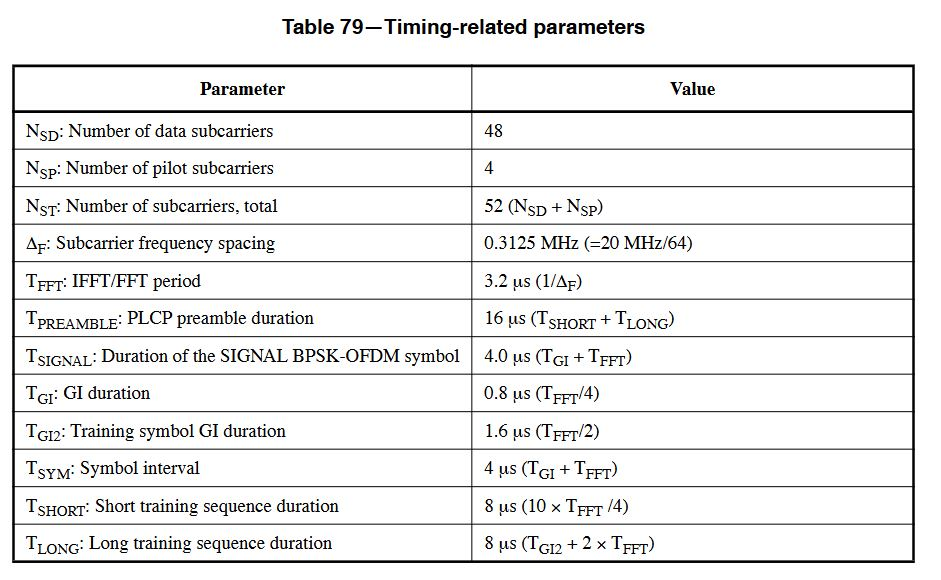
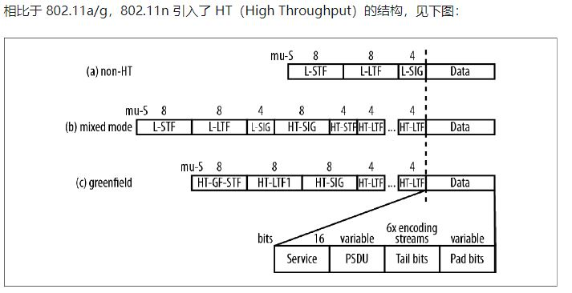
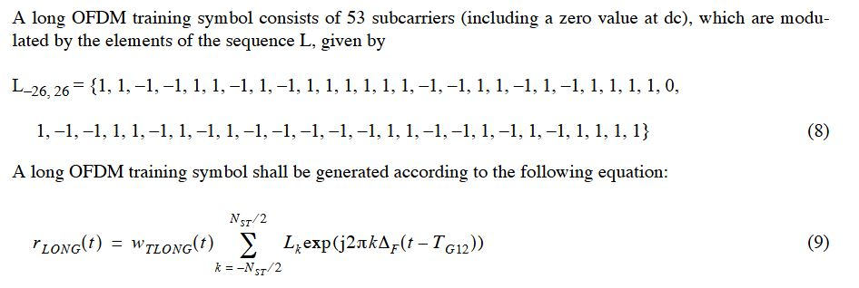
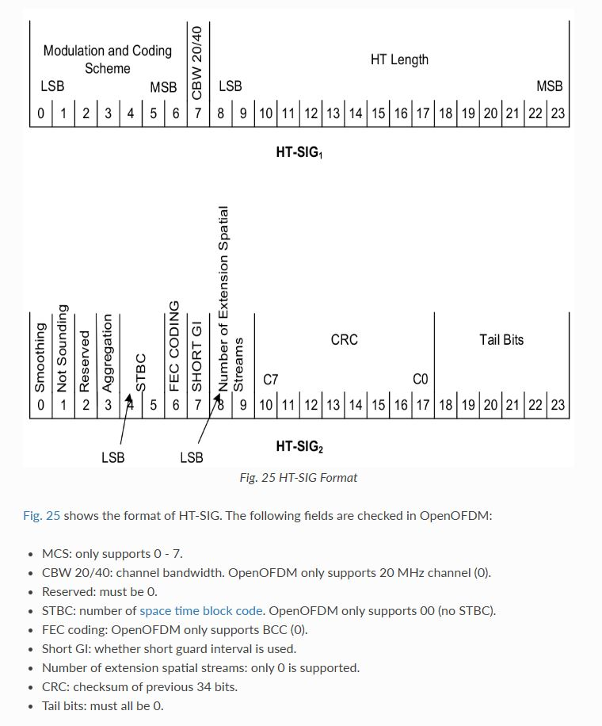
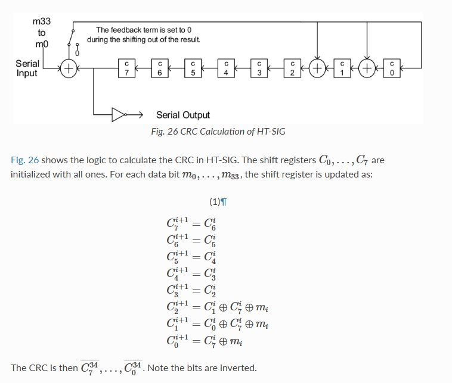
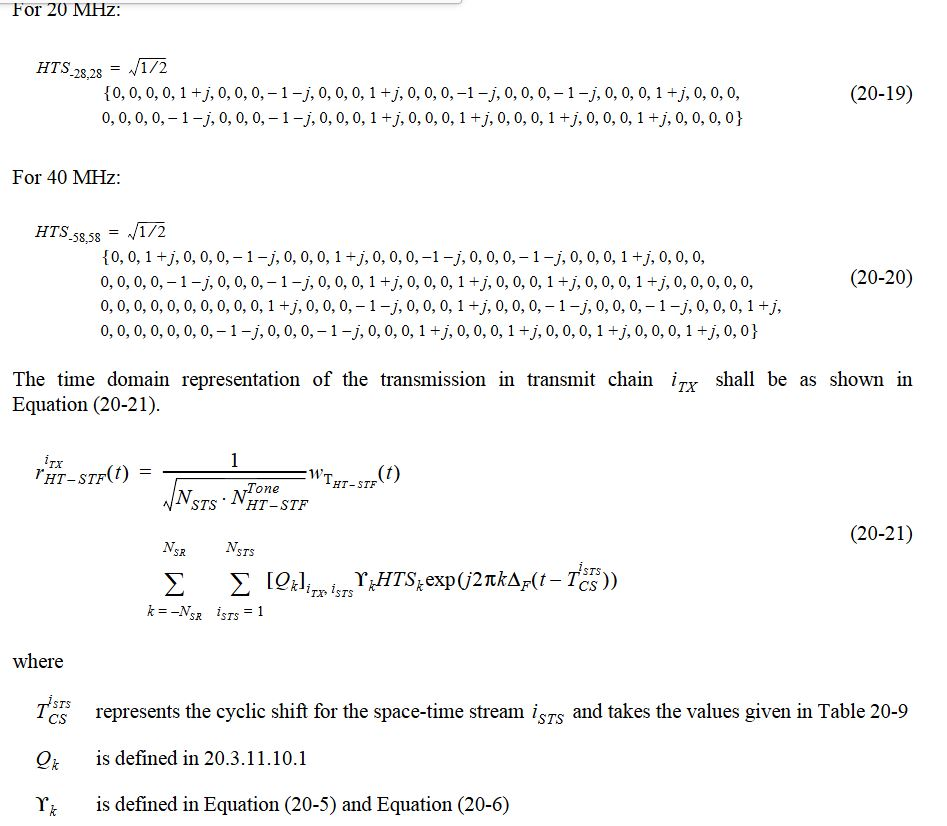
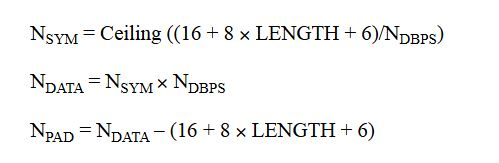
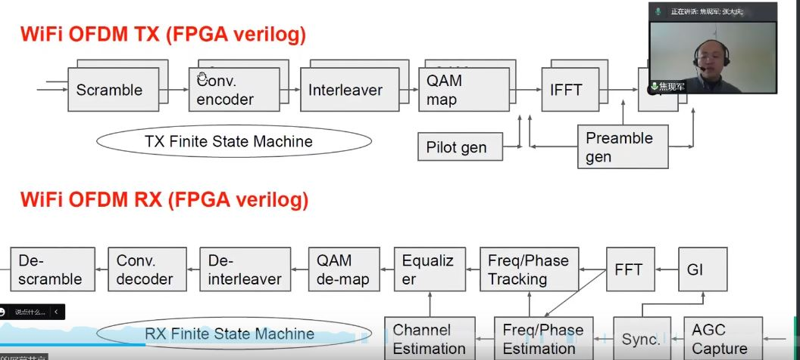

# dot11 read notes

IP包->MSDU->MPDU(MAC包)->PLCP->PSDU>phy
### mac层

;

数据链路层分为LLC（Logical Link Control，逻辑链路控制）子层及MAC（Media Access Control，媒体访问控制）子层。上层数据被移交给LLC子层后成为MAC服务数据单元，即MSDU（MAC Service Data Unit），而当LLC将MSDU发送到MAC子层后，需要给MSDU增加MAC包头信息，被封装后的MSDU成为MAC协议数据单元，即MPDU（MAC Protocol Data Unit），其实它就是802.11MAC帧。802.11MAC帧包括第二层报头、帧主体及帧尾

### 物理层
与数据链路层相似，物理层也分为两个子层。上层为PLCP（Physical Layer Convergence Procedure，物理层汇聚协议）子层，下层为PMD（Physical Medium Dependent，物理媒介相关）子层。PLCP子层将数据链路层传来的数据帧变成了PLCP协议数据单元（PLCP Protocol Data Unit，PPDU），随后PMD子层将进行数据调制处理并按比特方式进行传输。
PLCP接收到PSDU（MAC层的MPDU）后，准备要传输的PSDU（PLCP Service Data Unit ,PLCP服务数据单元），并创建PPDU，将前导部分和PHY报头添加到PSDU上。前导部分用于同步802.11无线发射和接收射频接口卡。创建PPDU后，PMD子层将PPDU调制成数据位后开始传输。

###### MPDU
在无线网络安全中，MSDU是Ethernet报文，经过添加完整性校验MIC、分帧、省电模式下报文缓存、加密、序列号赋值、CRC校验、MAC头之后成为MPDU，MPDU就是 指的经过802.11协议封装过的数据帧。A-MSDU技术是指把多个MSDU通过一定的方式聚合成一个较大的载荷。通常，当AP 或无线客户端从协议栈收到报文（MSDU）时，会打上Ethernet报文头，称之为AMSDUSubframe，而A-MSDU技术旨在将若干个A-MSDUSubframe按照802.11协议格 式，封装成一个MPDU报文单元
(即数据链路层交给物理层的DATA)

plcp(physical layer converge protocol)； 
ppdu(physical layer protocol data unit)； 
psdu(physical service data unit) 
PLCP 可以看成 PPDU 的 Header 部分，包含了 MCS，data rate 等信息，而 PSDU 是我们实际从 MAC 层得到的要传输的数据，PPDU 则是 PLCP+PSDU

### 物理参数
;
a/g采用20Mhz带宽，n支持某些40M的信道

;

## 802.11n结构
mixed mode为强制支持,n相比于a增加了ht域的字符
;
80211a的PPDU格式
;

## L-STF:
2个sym，160samples,
一个L-STF16个样点，总共16*10=160samples，频域生成,调整到对应子载波位置上作64点IFFT，截取前16个周期时域点，量化；
;

## L-LTF:
2个sym,16+16+64+64=160samples，
频域生成，与STF相同作64点IFFT，得到64时域点，量化；
;

## L_signal
1个sym，(24*2+4+12)+16=80samples
bit0-3表示RATE传输速率，HT模式默认6Mbps，
bit4保留为0,
bit5-16,LENGTH表示无符号MAC请求传输的PSDU的字节数，bit17为前17个的偶校验位，LSB先发送
6个bit的tail保留为0,
不进行加扰，
按卷积效率1/2，bpsk调制，不进行打孔，以6Mbps的速率发送
;

## ht-signal
2个sym，160samples
48个数据点(96个编码点)如果检测到rate为6M，检查L-SIG和HT-SIG的BPSK星座点，L-SIG为0,1同相，HT-SIG为正交，检测正交分量样本多于同相，

;
MCS: only supports 0 - 7.
CBW 20/40: channel bandwidth. OpenOFDM only supports 20 MHz channel (0).
Reserved: must be 0.
STBC: number of space time block code. OpenOFDM only supports 00 (no STBC).
FEC coding: OpenOFDM only supports BCC (0).
Short GI: whether short guard interval is used.
Number of extension spatial streams: only 0 is supported.
CRC: checksum of previous 34 bits.
Tail bits: must all be 0
MCS（7bit）：0-76中的某一种来表示发送数据字段的调制编码方案
20/40MHz（1bit）：用来指示发送的是20MHz还是40MHz带宽。
长度（16bit）：指示数据的长度
平滑（1bit）：在进行Tx波束成型和空间扩展后，得到发射机和接收机之间的信道可以超过800ns。高延迟传输可解除相邻子载波的相关性。某些Tx波束成型也会导致相邻子载波间相位的不连续。在使用子载波平滑技术时，这两种情况会削弱信道估计。在这两种情况下，发射机应该将平滑比特设置为0，以通知接收机只是用每载波信道估计。
非探测（1bit）：设为0时发送的是探测分组。探测分组用于收集Tx波束成型和链路适应的信道状态信息。为了将探测扩展到数据字段之外的额外空间域上，扩展空间流数字段所设的值大于0。
保留位（1bit）
聚合（1bit）：表示有效载荷包含单个MPDU（为0）或一个MPDU聚合（为1）。
STBC（2bit）：表示STBC操作的维度
FEC编码（1bit）：为0时表示数据为BCC编码，为1时表示数据为LDPC编码。
短GI（1bit）：为1时表示使用400ns短保护间隔，为0时表示使用800ns标准长保护间隔。
扩展空间流数（1bit）：见非探测描述。
CRC（8bit）：生成多项式为G(D)=D^8+D^2+D^1+1
ht_crc生成;
## ht-stf
1个sym,5*16=80samples
用于改进mimo系统中的自动增益控制，
20Mhz序列和l-stf一样，40Mhz通过将20MHz的序列幅值并旋转上半部分的子载波
暂时没有实现40Mhz的，不用mimo
;

## ht-ltf
工程中只发了一个sym，80samples

前面共计720个samples，一个sym的legacy_siganl,2个sym的ht_signal，其他为固定数据

## DATA域
## service
16bit，bit0-6 set to 0，用于同步解扰器;bit7-15 reserved to 0

## PSDU

## tail
6bit,确保卷积编码器返回置零状态

## pad
补充位，用于填充到整OFDM符号
;

## 物理层发射接受流程框图
;

# 发射机状态机
<!-- ; -->

state1：signal和ht_signal域组帧
state11：data域组帧
state2：加扰后的卷积、打孔、交织、导频插入和IFFT
state3：最后整个数据的输出