意义：
无人机群远距离自组织多跳网络，机间链路协作，物理层，动态路由协议
CSI感知

## wifi结构
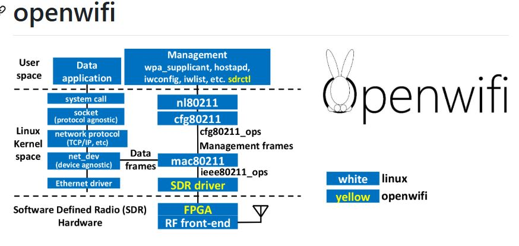  
从用户空间最后到sdr的驱动到FPGA分两条路，一路是应用数据，首先创建一个套接字，然后绑定一个接口(如，以太网接口、 WiFi 接口)。接下来将数据写入到套接字缓冲区，再将缓冲区的数据发送出去。应用程序进入系统调用后，首先进入套接字层，这个过程中一个最重要的数据结构就是sk_buff，一般称为skb 。一个skb结构中的成员包含着缓冲区的地址以及数据长度。然后通过复杂的网络协议层，来到设备无关层，具体接口通过 net_device_ops结构实现，该结构对应了net_device的很多操作。由于mac80211会事先注册ops函数，mac80211也可以看作是一个 net_device ，当一个数据包通过 WiFi 传输时，相关的传输函数 ieee80211_subif_start_xmit将被调用最后变成数据帧交给mac80211，通过 mac80211 中的 local->ops->tx ，注册到设备驱动中的回调函数将会被调用，回调函数在驱动中被定义。另一路通过专门对wifi进行管理的工具，如wpa_supplicant,hostapd,iwconfig等，经linux内核空间nl80211、cfg80211协议栈，交给mac80211；  

nl80211将请求传递给cfg80211,这是一个通用的无线网络配置框架，负责管理无线设备状态，处理WIFI设备的配置比如信道、频率等。
mac80211是实现80211MAC层的模块，处理所有与WIFI相关的协议逻辑，如帧的生成、发送和接收。  
mac80211通过ieee80211_ops定义的函数接口api调用sdr.ko驱动，把各类数据和sdr交互，用sdr.ko控制整块fpga的工作。  
openwifi属于softmac架构，管理、控制帧通过mac80211协议栈控制，lowmac的csma/ca、cca在fpga内部  

;
数据从mac80211过来之后交给sdr驱动，sdr驱动调用rx_intf、openofdm_rx_driver、xilinx_dma_driver、xpu_driver、openofdm_tx_driver、tx_intf_driver等驱动对fpga控制；  
sdr_driver数据先交给axis_dma，dma核和tx_intf RTL模块用axis总线相连，tx_intf进行队列管理等功能，收到来自XPU的可以发送、时间戳等标志和数据后把数据、发射参数交给PMD物理层发射机openofdm_tx，openofdm_tx进行物理层编码调制组帧后把数据交给tx_iq_intf和dac_intf最后交给ad9361发射。  
ad9361实时接收电磁波后，经adc_intf和rx_iq_intf后得到IQ数据交给openofdm_rx接收机得到整个帧的结构和数据，把一系列参数交给pl_to_m_axis RTL模块用于处理mac80211需要的数据如rssi报告、时间戳报告、工作参数等信息；帧数据交给XPU模块，进行MAC帧解析，交给tx_control发射控制模块，交给csma_ca虚拟载波侦听和冲突避免模块，经过过滤把mac头信息交给pl_to_m_axis；  
从ad9361获得实时agc增益对从IQ数据算得的rssi进行补偿，把实际的信号强度交给pl_to_m_axis和cca信道清除评估模块，物理上信道空闲后把标志位给csma模块。  

### glossary:
RTS/CTS：request to send;clear to send，clear to send
cca(channel clear assessment)
nav(network allocation vector )，rts/cts机制，Nav不到0就挂起backoff倒数，由RTS/CTS和CP期除PSPOLL帧外的帧更新
BEB(binary exponential backoff)
backoff 回退，随机大小的竞争窗口，发送倒计时，只有在监听到信道空闲时才倒数，
PCF（point coordination function）
DCF(distributed coordination function)csma/ca必须实现
RA(received address)
TA(transmite address)
plcp(physical layer converge protocol);  
ppdu(physical layer protocol data unit);  
psdu(physical service data unit)  

### 数据包层次
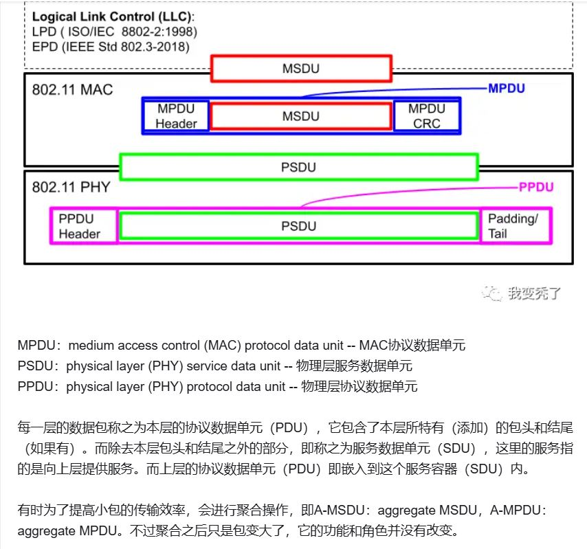
IP包->MSDU->MPDU(MAC包)->PLCP->PSDU>phy
在无线网络安全中，MSDU是Ethernet报文，经过添加完整性校验MIC、分帧、省电模式下报文缓存、加密、序列号赋值、CRC校验、MAC头之后成为MPDU，MPDU就是指的经过802.11协议封装过的数据帧。A-MSDU技术是指把多个MSDU通过一定的方式聚合成一个较大的载荷。通常，当AP或无线客户端从协议栈收到报文（MSDU）时，会打上Ethernet报文头，称之为AMSDUSubframe，而A-MSDU技术旨在将若干个A-MSDUSubframe按照802.11协议格 式，封装成一个MPDU报文单元(即数据链路层交给物理层的DATA)  
PLCP 可以看成 PPDU 的 Header 部分，包含MCS，data rate 等信息，而PSDU是我们实际从 MAC 层得到的要传输的数据，PPDU则是 PLCP+PSDU

### MAC层帧结构
数据链路层分为LLC（Logical Link Control，逻辑链路控制）子层及MAC（Media Access Control，媒体访问控制）子层。上层数据被移交给LLC子层后成为MAC服务数据单元，即MSDU（MAC Service Data Unit），而当LLC将MSDU发送到MAC子层后，需要给MSDU增加MAC包头信息，被封装后的MSDU成为MAC协议数据单元，即MPDU（MAC Protocol Data Unit），其实它就是802.11MAC帧。802.11MAC帧包括第二层报头、帧主体及帧尾  

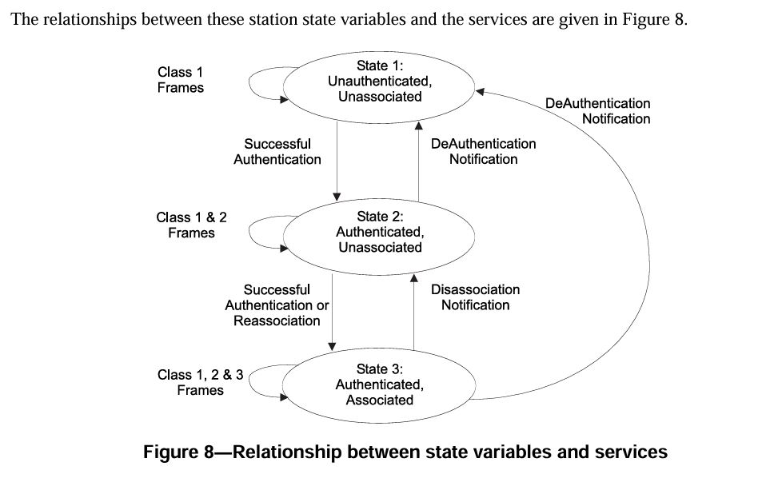  
不同状态下能够发送的MAC帧类型不同，例如state1下只能发送Class 1型帧。  
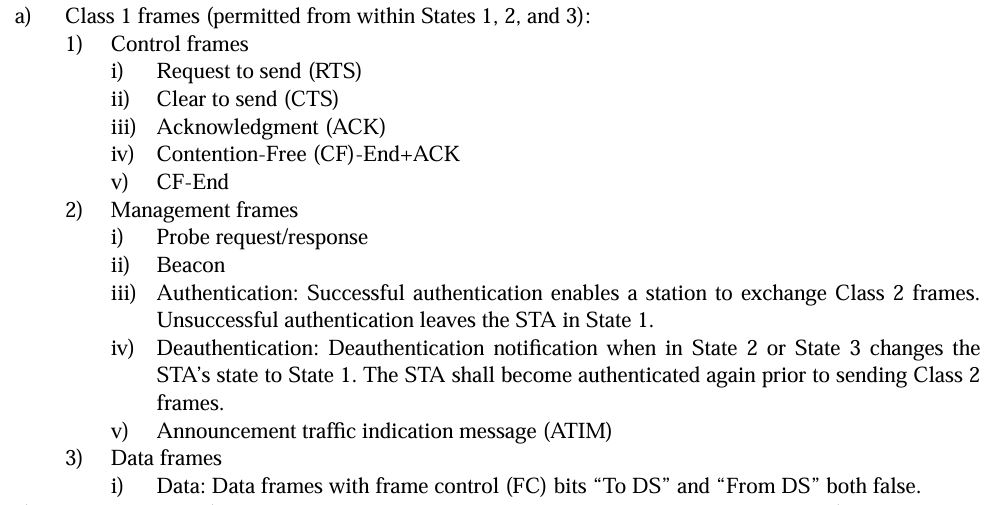  
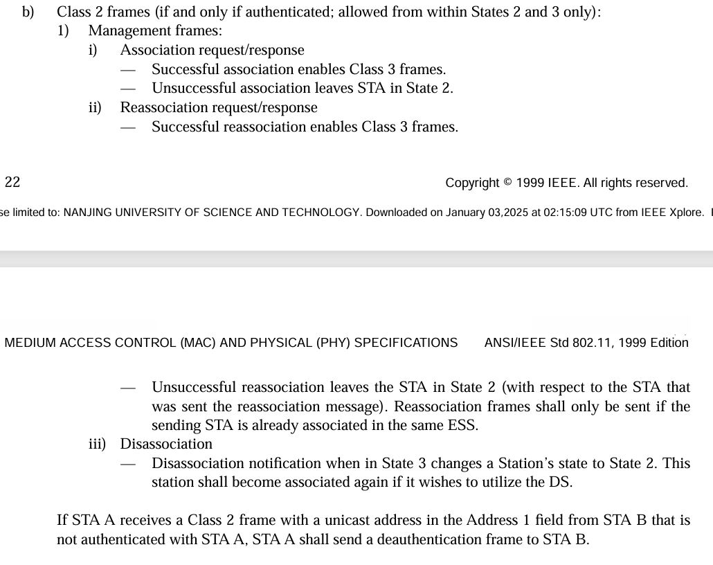  
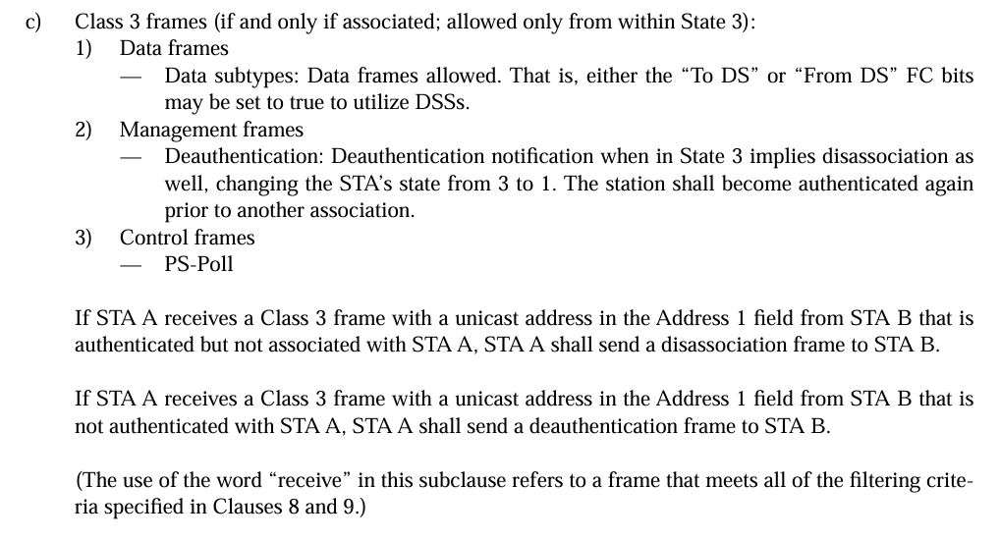  
;  
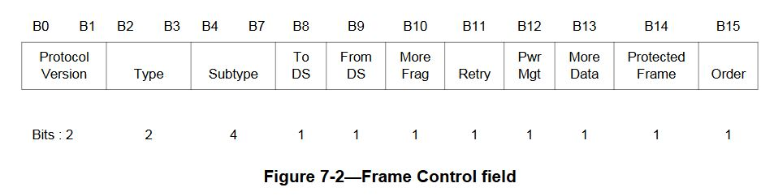  
Address 2, Address 3, Sequence Control, Address 4,和Frame Body字段只在某些帧中出现

Type(management,control,data)和Subtype字段共同决定MAC帧类型，To DS为1则表示帧发往DS(distributing system，即AP),From DS表示来自DS
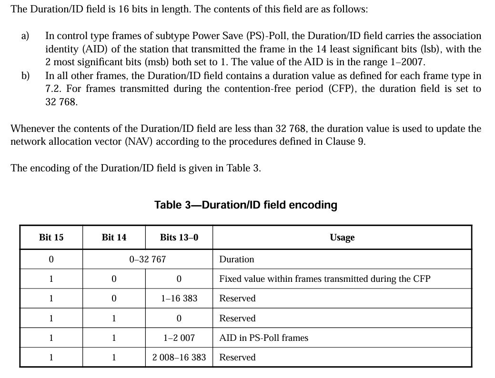duration表示 微秒

Address：
可能包含BSSID：一个按规则生成的46位随机数
DA(Destination Address),SA(Source Address),RA(Receiver Address),TA(Transmitter Address),

Sequence Control:
包含Sequence Number和Fragment Number，Sequence Number用12位标识MSDU序号，Fragment Number用4位标识MSDU单元中片段标号

FCS：
32位CRC


#### control frames
RTS帧  
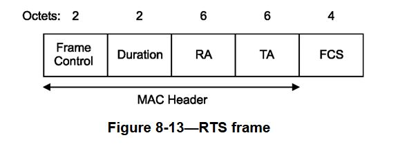  
CTS帧  
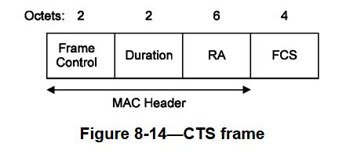  
ACK帧  
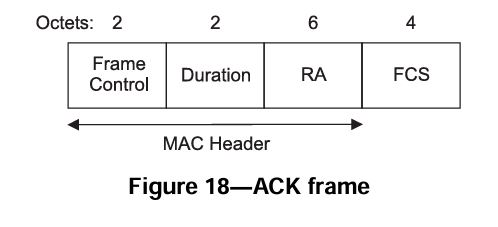  
还有PS-Poll(Power-Save Poll)、CF-End(contension Free-End)、CF-ACK等等
CTS/RTS不是每帧都需要建立连接，对于过短数据长度的帧可能没有rts/cts建立，该机制可以在dot11RTSThreshold attribute设为always、never、or 超过length threshold
CTS/RTS帧，在duration字段包含传输和ACK所的占用信道时间(us)，可以被所有sta接收，用来更新每个sta的nav长度，

#### data frames
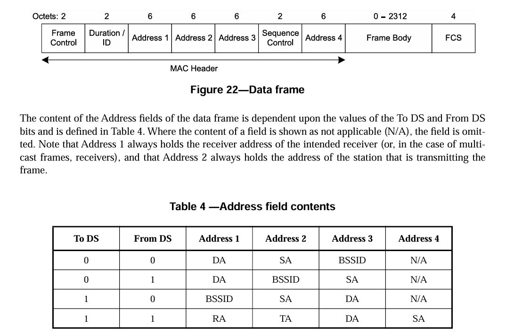
#### management frames
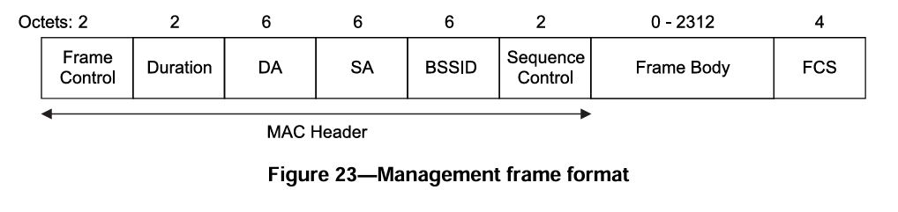
有Beacon帧、IBSS ATIM帧(Announcement Traffic Indication Message)帧、Disassociation帧、Association Request、Association Response、Reassociation Request、Reassociation Response、Probe Request帧等等。


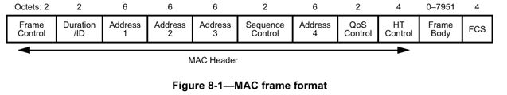
一般的MAC帧结构如图，FrameControl主要规定帧类型、分为管理帧、数据帧、控制帧，，控制帧用于控制对物理信道的占用，发送方向、帧聚合是否有更多分片、是否是重传帧、电源省电模式、缓存中是否有更多数据、是否用WEP加密、是否为数据帧。  

管理帧(management)用于AP/STA信标帧、接入、认证、连接等。分为连接(Association)请求和回应，重连(Reassociation)请求和回应，探测(Probe)请求和回应，时间同步帧(Timing Advertisement)，信标帧(Beacon)，ATIM(Announcement Traffic Indication Message)(IBSS网络中睡眠唤醒节能)，断连(Disassociation)、是/否授权(Authentication)、动作帧(Action)(协调同步网络节点间行为如频谱切换、同步定位等)，无需ACK的动作帧(Action-noACK)、保留帧(Reserved)  

控制帧(Control)用于控制对物理信道的占用，封装帧(Control Wrapper)封装多个其他类型的帧，块确认/块确认请求帧(Block Ack Request)，省电轮询(PowerSave-POLL)帧，RTS，CTS，ACK，无竞争结束(CF-END,Contension-Free-END)AP在PCF模式下控制其他STA的信道访问模式，优化无竞争期操作的复合控制帧(CF-END，CF-ACK)  
CF-END表示PCF功能结束，CF-ACK表示PCF下的ACK回复，CF-POLL表示PCF下的数据轮询

数据帧(Data)除正常数据帧外，也有类似的，在PCF下的Data + CF-Ack、Data+CF-end、 Data + CF-Ack + CF-Pol；带有Qos的数据帧(QoS Data)、在PCF下的(QoS Data + CF-Ack)等。


Duration/ID用于更新NAV向量，AID用于表示AP与STA之间的连接ID;  
Address：BSSID，Destination Adress，Source Adress，Reciever Adress，Transmitter Adress。不一定全都有。  
Qos表示数据包优先级  
HtControl表示对HT模式的一些控制  
FrameBody最大长度在不同版本下不同，80211a/g最大长度为2312，n最大长度为7951  
Sequence Control：分片序号和队列序号。
FCS：校验  


  
具体查看80211-2012-p480  
ProtocolVersion表示协议版本  
Tpye和Subtype规定帧类型，
To DS和From DS表示帧传输方向，把DS看作AP；00表示Station之间的AD Hoc类似的通信，或者控制侦、管理侦;01表示Sta接收的帧；10表示Sta发送的帧；11表示无线桥接器上的帧。  
在数据或管理帧中MoreFrag为1时表示之后还有更多分片，其他都为0  
Retry为1时表示在数据或管理帧中，这是一个重传帧，其他都为0
PowerManagement表示电量管理模式，在BSS和Mesh有不同的定义，见协议  
MoreData用于表示STA在PS模式是否有更多缓存数据等待传输，用于省电管理  
ProtectedFrame用于指示FrameBody是否经过密码学加密封装

特殊帧有具体的格式如CTS、RTS、ACK，如最重要的RTS、CTS、ACK。  


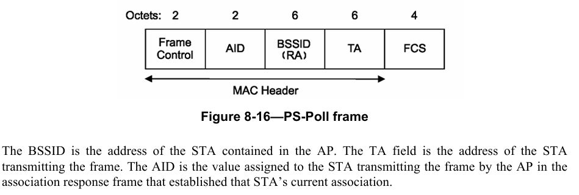

#################################
Qos、HT Control的详细解析
#################################


### 物理层
与数据链路层相似，物理层也分为两个子层。上层为PLCP（Physical Layer Convergence Procedure，物理层汇聚协议）子层，下层为PMD（Physical Medium Dependent，物理媒介相关）子层。
PLCP子层将数据链路层传来的数据帧变成了PLCP协议数据单元（PLCP Protocol Data Unit，PPDU），随后PMD子层将进行数据调制处理并按比特方式进行传输。PLCP接收到PSDU（MAC层的MPDU）后，准备要传输的PSDU（PLCP Service Data Unit ,PLCP服务数据单元），并创建PPDU，将前导部分和PHY报头添加到PSDU上。前导部分用于同步802.11无线发射和接收射频接口卡。创建PPDU后，PMD子层将PPDU调制成数据位后开始传输。


## 内核空间
### nl80211
介于用户空间与内核空间之间的 API ，可以算是 cfg80211 的前端，也会生成事件(events) 信息。该模块依赖 netlink 协议来在两个空间进行信息交互（注册为Generic Netlink家族）。Netlink 是一个 Linux 中的 socket 类型，用于在内核与用户空间之间传递事件。基本就是一个接口，其只会将数据包装为合适的格式然后在用户与内核空间两边传输。

```
支持的消息类型：  
enum nl80211_commands {
    NL80211_CMD_GET_WIPHY,         // 查询无线设备
    NL80211_CMD_SET_WIPHY,         // 配置无线设备
    NL80211_CMD_TRIGGER_SCAN,      // 触发扫描
    NL80211_CMD_CONNECT,           // 连接网络
    NL80211_CMD_ROAM,              // 漫游请求
    NL80211_CMD_FRAME,             // 发送管理帧
};
```
### cfg80211
这是一个管理、配置 WLAN 设备的中间层，是连通用户空间与内核空间的桥梁，在内核空间提供配置管理服务，用于对无线设备进行配置管理，通过提供一组函数接口（cfg80211_ops）和结构体（wiphy），协调用户空间请求和MAC层操作。硬 MAC 设备和软 MAC 设备都需要 cfg80211 才能工作。
网络设备驱动要使用cfg80211，需要在cfg80211中注册一系列硬件功能结构体，
而 mac80211 只是一个驱动 API ，它只支持软件实现的软 MAC 设备。
主要工作职责：管理无线网络接口（虚拟AP，WDS等）；频谱管理（DFS，信道选择）；认证机制协调（WPA/WPA2）；扫描结果处理；通信参数管理（功率，带宽）
```
struct cfg80211_ops {
    int (*scan)(struct wiphy *wiphy, struct net_device *dev,
                struct cfg80211_scan_request *request); // 扫描请求
    int (*connect)(struct wiphy *wiphy, struct net_device *dev,
                   struct cfg80211_connect_params *sme); // 连接请求
    int (*disconnect)(struct wiphy *wiphy, struct net_device *dev, 
                      u16 reason_code); // 断开连接


    static int __init cfg80211_init(void)
{
    // 1. 创建netlink套接字（nl80211）
    nl80211_socket = netlink_kernel_create(&init_net, NETLINK_GENERIC, &cfg);

    // 2. 注册sysfs文件系统接口
    rc = register_netdevice_notifier(&cfg80211_netdev_notifier);

    // 3. 注册通用设备类型
    rc = wiphy_class_register(&wiphy_class);

    // 4. 初始化RFKill子系统
    rc = rfkill_global_init();
}
};
```
### mac80211
结构体 ieee80211_ops 负责将不同设备驱动实现的回调函数与 mac80211 提供的 API 映射绑定起来。当驱动模块插入注册时，这些回调函数就被注册到 mac80211 里面(通过 ieee80211_alloc_hw 实现)，接着 mac80211 就绑定了相应的回调函数，作为内核模块，实现MAC层的软件部分，提供硬件驱动与上层（cfg80211）之间的适配层根本不用知道具体的名字，以及实现细节等。  
主要工作职责：802.11帧构造/解析（管理/控制/数据帧）；速率控制算法（Minstrel, PID等）；QoS实现（WMM）；电源管理（PSM）；聚合帧处理（A-MPDU/A-MSDU）
```
注册流程// 在cfg80211初始化时调用
int __init mac80211_init(void)
{
    rc = rc80211_minstrel_init();    // 速率控制初始化
    rc = ieee80211_iface_init();     // 虚拟接口系统初始化
    rc = rate_ctrl_register();       // 注册速率控制算法
}

// 驱动注册时调用的核心函数
int ieee80211_register_hw(struct ieee80211_hw *hw)
{
    // 创建wiphy设备
    wiphy = wiphy_new(&mac80211_config_ops, sizeof(struct ieee80211_local));
    
    // 初始化内部状态
    INIT_LIST_HEAD(&local->interfaces);
    INIT_LIST_HEAD(&local->rx_handlers);
    
    // 向cfg80211注册
    wiphy_register(wiphy);
}

int __init mac80211_init(void)
{
    // 1. 注册速率控制算法
    rc = rc80211_minstrel_init();

    // 2. 创建ieee80211_wq工作队列
    ieee80211_wq = alloc_ordered_workqueue(...);

    // 3. 注册网络设备操作
    rc = register_pernet_device(&ieee80211_pernet_ops);

    // 4. 注册帧处理函数
    rc = ieee80211_iface_init();
}
```
### sdr驱动
工作职责：??直接控制网卡硬件（寄存器访问/DMA配置）；处理硬件中断（接收/发送完成）；实现mac80211定义的操作接口

#### 驱动加载流程
1.获取设备树节点后，of_match_node函数检查设备树与驱动名是否匹配，把驱动挂载在设备树对应的节点下。
2.dev = ieee80211_alloc_hw(sizeof(*priv), &openwifi_ops)，关键注册，分配IEEE802.11硬件抽象结构，为wifi设备分配私有数据结构（*priv）和回调函数表(&openwifi_ops),这里会向mac80211
3.初始化私有数据。（1）读取设备树节点model名称，判断FPGA设备类型。（2）bus_find_device函数在spi_bus_type总线上查找名为 "ad9361-phy" 的设备，获取AD9361设备指针存储到priv->ad9361_phy。（3）bus_find_device函数在platform_bus_type总线上名为的 "cf-ad9361-dds-core-lpc" dds设备，platform_get_drvdata和iio_priv函数获取IIO设备axi_ad9361私有配置dac/adc数据，存储到priv->dds_st
4.初始化射频参数，rssi校准，带宽，采样率，指定发射/接收天线，开启射频
5.IEEE802.11硬件参数配置，指定信道频段，复制定义信道和速率表，Ht模式；分配MAC地址。
6.err = ieee80211_register_hw(dev)向内核注册无线网卡设备，关键注册，
7.调试接口创建，
sysfs_create_bin_file(&pdev->dev.kobj, &priv->bin_iq);创建IQ数据传输接口，直接访问基带IQ数据的二进制接口  
sysfs_create_group(&pdev->dev.kobj, &tx_intf_attribute_group);创建发射控制属性组，调整发射参数的用户空间接口  
sysfs_create_group(&pdev->dev.kobj, &stat_attribute_group);创建统计信息属性组，实时性能监控数据导出  
8.队列统计、包传输统计等、传输成功率等40多项系统统计初始化
9.向cfg80211的wiphy结构体注册信息，初始化并设置设备的射频kill状态：首先获取射频启用状态，设置内核射频kill状态，启动轮询以监视射频开关变化。
#### 回调函数表
```
static const struct ieee80211_ops openwifi_ops = {
	.tx			       = openwifi_tx,                       //必须，发送单帧处理。
	.start			   = openwifi_start,
	.stop			   = openwifi_stop,
	.add_interface	   = openwifi_add_interface,
	.remove_interface  = openwifi_remove_interface,
	.config			   = openwifi_config,
	.set_antenna       = openwifi_set_antenna,
	.get_antenna       = openwifi_get_antenna,
	.bss_info_changed  = openwifi_bss_info_changed,
	.conf_tx		   = openwifi_conf_tx,
	.prepare_multicast = openwifi_prepare_multicast,
	.configure_filter  = openwifi_configure_filter,
	.rfkill_poll	   = openwifi_rfkill_poll,
	.get_tsf		   = openwifi_get_tsf,
	.set_tsf		   = openwifi_set_tsf,
	.reset_tsf		   = openwifi_reset_tsf,
	.set_rts_threshold = openwifi_set_rts_threshold,
	.ampdu_action      = openwifi_ampdu_action,
	.testmode_cmd	   = openwifi_testmode_cmd,
};
```

### 启动和注册流程
注册初始化从下而上，首先做硬件设备设备注册，当sdr.ko设备驱动初始化时，调用platform_driver函数，根据.of_match_table匹配设备树中的节点.compatable名称对应，设备被探测到后执行硬件驱动初始化函数openwifi_dev_probe函数:1.ieee80211_alloc_hw分配硬件上下文：(参数：sizeof_priv（驱动私有数据大小）和ops（驱动实现的ieee80211_ops）返回struct ieee80211_hw);2.初始化硬件（寄存器、DMA、中断等）;3.调用ieee80211_register_hw(hw),该函数内部会调用mac80211的注册逻辑，最终会调用cfg80211的注册函数（wiphy_register）。  
然后执行mac80211定义的初始化，ieee80211_register_hw会：1.初始化mac80211的内部状态（软队列、定时器等）。2.通过wiphy_new创建struct wiphy（代表一个无线设备）3.将mac80211实现的配置操作（cfg80211_ops）赋给wiphy 4.调用wiphy_register（这是cfg80211的接口）将wiphy注册到cfg80211。
然后执行cfg80211的初始化：1.调用nl80211_init（这注册了nl80211的Netlink套接字和操作集）。初始化内部数据结构（如无线设备链表）。2.当驱动调用wiphy_register时，cfg80211将该wiphy添加到全局链表。为这个设备在sysfs中创建节点。通知用户空间（如通过Netlink发送NL80211_CMD_NEW_WIPHY事件）。
然后做nl80211的初始化，在cfg80211初始化时，通过nl80211_init：调用netlink_kernel_create创建Netlink套接字（协议为NETLINK_GENERIC），注册nl80211到通用Netlink，设置处理函数（nl80211_ops，包含所有的命令处理，例如扫描、连接等）
用户空间工具（如iw）通过Netlink套接字发送命令和接收事件


## wifi 具体工程结构
#### ps引出的接口
S_AXI_ACP接interconnect2 控制dma1，用于side_ch，数据采集  
S_AXI_HP3接interconnect0 控制dma0，用于tx_intf,发射数据存储  
M_AXI_GP0控axi_ad9361,axi_gpreg  
M_AXI_GP1控主模块的七个IP核  
### 时钟和数据速率
ps输出  FCLK_CLK0 100Mhz -ps_clk -xpu  
        FCLK_CLK1 200Mhz -axi_ad9361_delayclk(7 series)  
        FCLK_CLK2 125Mhz  
axi_ad9361输入160MHZdata_clk,输出l_clk 160Mhz分频到40Mhz作为adc,dacIP核的时钟，输入主模块adc_clk
40Mhz倍频到100Mhz输入主模块m_axi_mm2s_aclk
openwifi主模块输入
ps_clk 100Mhz  
adc_clk 40Mhz  
m_axi_mm2s_aclk 100Mhz  
## openofdm_tx  
### 物理参数
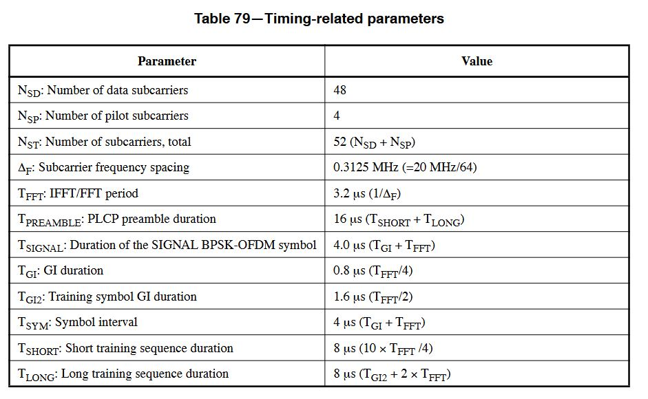;
a/g采用20Mhz带宽，n支持某些40M的信道
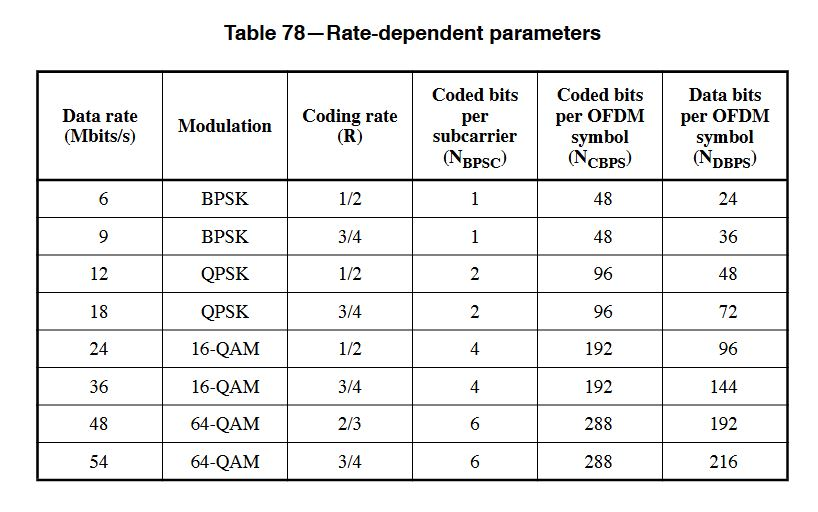;
#### 802.11n结构
mixed mode为强制支持,n相比于a增加了ht域的字符
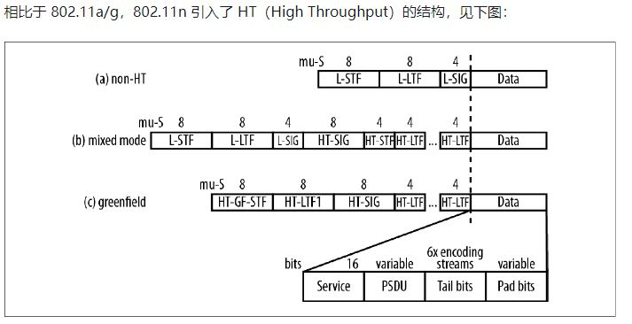;
80211a的PPDU格式
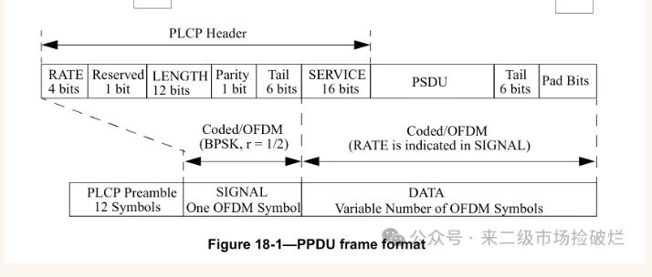;
#### L-STF:
2个sym，160samples,
一个L-STF16个样点，总共16*10=160samples，频域生成,调整到对应子载波位置上作64点IFFT，截取前16个周期时域点，量化；
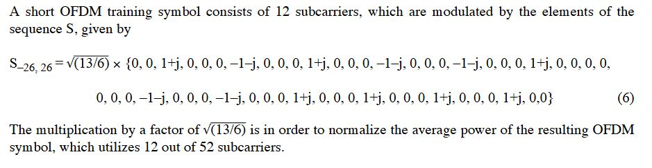;

#### L-LTF:
2个sym,16+16+64+64=160samples，
频域生成，与STF相同作64点IFFT，得到64时域点，量化；
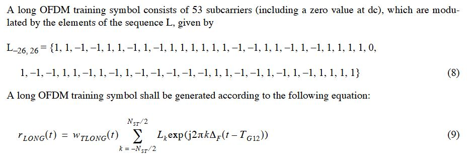;


#### L_signal
1个sym，(24*2+4+12)+16=80samples
bit0-3表示RATE传输速率，HT模式默认6Mbps，
bit4保留为0,
bit5-16,LENGTH表示无符号MAC请求传输的PSDU的字节数，bit17为前17个的偶校验位，LSB先发送
6个bit的tail保留为0,
不进行加扰，
按卷积效率1/2，bpsk调制，不进行打孔，以6Mbps的速率发送
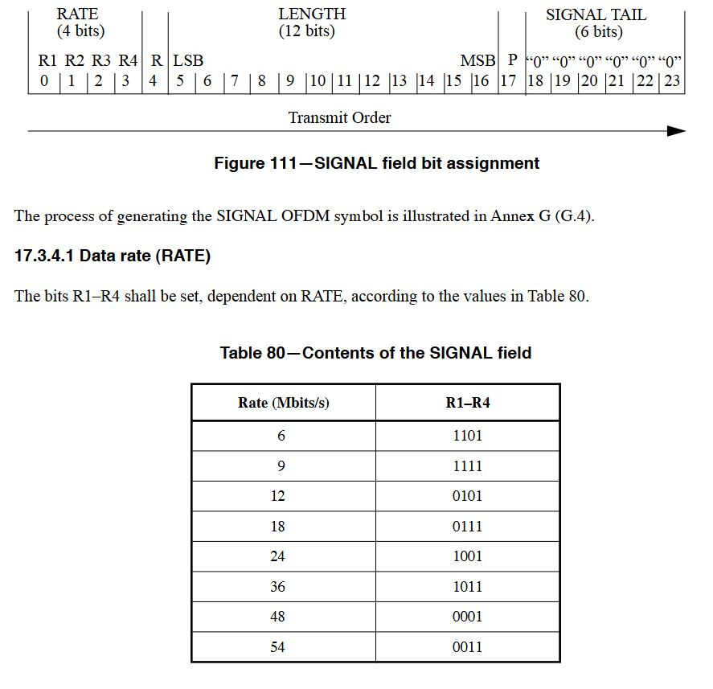;


#### ht-signal
2个sym，160samples
48个数据点(96个编码点)如果检测到rate为6M，检查L-SIG和HT-SIG的BPSK星座点，L-SIG为0,1同相，HT-SIG为正交，检测正交分量样本多于同相，

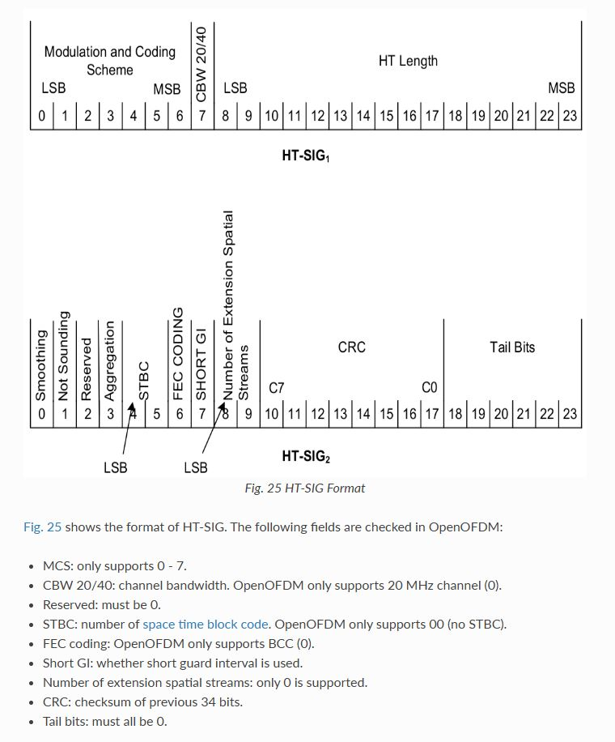;
MCS: only supports 0 - 7.
CBW 20/40: channel bandwidth. OpenOFDM only supports 20 MHz channel (0).
Reserved: must be 0.
STBC: number of space time block code. OpenOFDM only supports 00 (no STBC).
FEC coding: OpenOFDM only supports BCC (0).
Short GI: whether short guard interval is used.
Number of extension spatial streams: only 0 is supported.
CRC: checksum of previous 34 bits.
Tail bits: must all be 0
MCS（7bit）：0-76中的某一种来表示发送数据字段的调制编码方案
20/40MHz（1bit）：用来指示发送的是20MHz还是40MHz带宽。
长度（16bit）：指示数据的长度
平滑（1bit）：在进行Tx波束成型和空间扩展后，得到发射机和接收机之间的信道可以超过800ns。高延迟传输可解除相邻子载波的相关性。某些Tx波束成型也会导致相邻子载波间相位的不连续。在使用子载波平滑技术时，这两种情况会削弱信道估计。在这两种情况下，发射机应该将平滑比特设置为0，以通知接收机只是用每载波信道估计。
非探测（1bit）：设为0时发送的是探测分组。探测分组用于收集Tx波束成型和链路适应的信道状态信息。为了将探测扩展到数据字段之外的额外空间域上，扩展空间流数字段所设的值大于0。
保留位（1bit）
聚合（1bit）：表示有效载荷包含单个MPDU（为0）或一个MPDU聚合（为1）。
STBC（2bit）：表示STBC操作的维度
FEC编码（1bit）：为0时表示数据为BCC编码，为1时表示数据为LDPC编码。
短GI（1bit）：为1时表示使用400ns短保护间隔，为0时表示使用800ns标准长保护间隔。
扩展空间流数（1bit）：见非探测描述。
CRC（8bit）：生成多项式为G(D)=D^8+D^2+D^1+1
ht_crc生成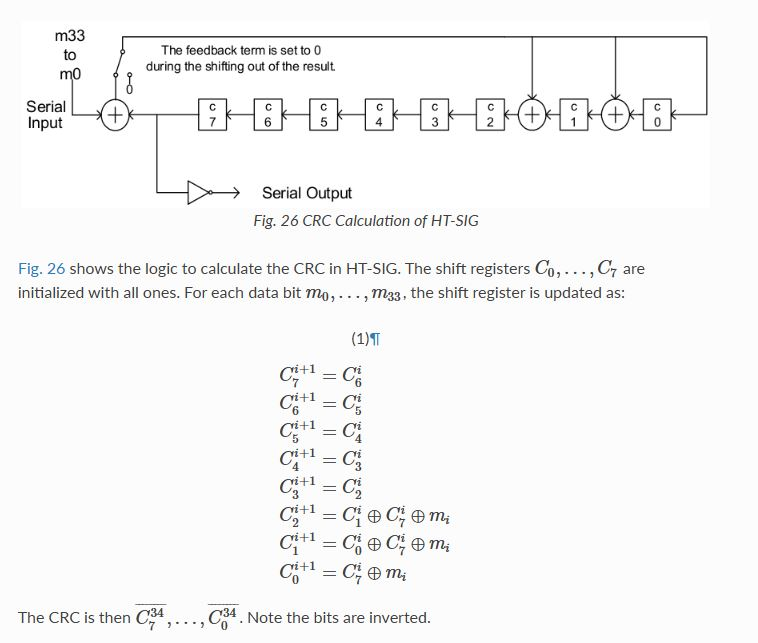;
#### ht-stf
1个sym,5*16=80samples
用于改进mimo系统中的自动增益控制，
20Mhz序列和l-stf一样，40Mhz通过将20MHz的序列幅值并旋转上半部分的子载波
暂时没有实现40Mhz的，不用mimo
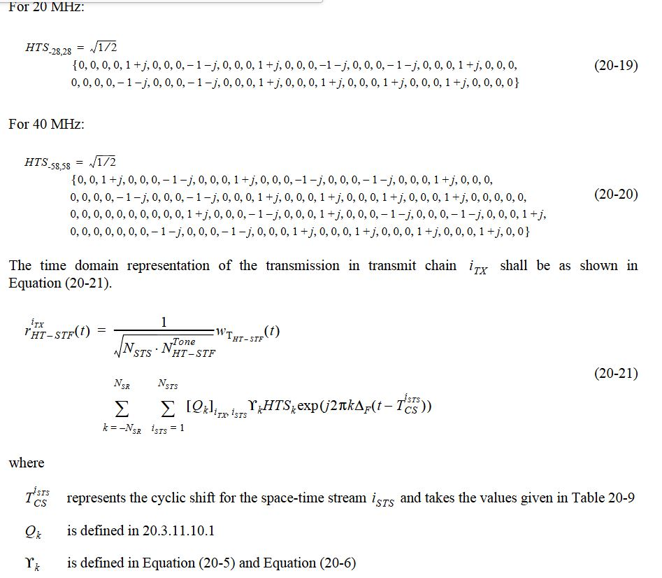;

#### ht-ltf
工程中只发了一个sym，80samples
前面共计720个samples，一个sym的legacy_siganl,2个sym的ht_signal，其他为固定数据
#### DATA域
#### service
16bit，bit0-6 set to 0，用于同步解扰器;bit7-15 reserved to 0
#### tail
6bit,确保卷积编码器返回置零状态

#### pad
补充位，用于填充到整OFDM符号
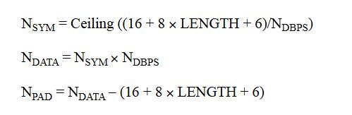;
### 输入输出接口
(
  input  wire        clk,//100M 
  input  wire        phy_tx_arest,//fromPS输出FCLK2的复位信号

  input  wire        phy_tx_start,//from tx_intf的tx_bit_intf模块输出phy_tx_start
  output reg         phy_tx_done,//dot11，输出完一个物理帧
  output reg         phy_tx_started,//dot11，开始输出一个物理帧

  input  wire [6:0]  init_pilot_scram_state,
  input  wire [6:0]  init_data_scram_state,

  input  wire [63:0] bram_din,
  output reg  [9:0]  bram_addr,

  input  wire        result_iq_ready,
  output wire        result_iq_valid,
  output wire [15:0] result_i,//最后I路数据，交给tx_intf的tx_iq_intf
  output wire [15:0] result_q
);

state1：signal和ht_signal域组帧
state11：data域组帧
state2：加扰后的卷积、打孔、交织、导频插入和IFFT
state3：最后整个数据的输出
### 以state3描述
收到开始信号后从S3_WAIT_PKT状态进入S3_L_STF
输出用简单的查找表模块l_stf_rom，已转化为最后的16位i和q前导数据，发送160samples后进入S3_L_LTF
输出用简单的查找表模块l_ltf_rom，已转化为最后的16位i和q前导数据，发送160samples两个sym后进入S3_L_SIG

S3_L_SIG组帧：
以plcp_bit计数，取bram_din前[0:23]为signal域，设定对应发射参数，根据bram_din[24]判断PKT类型为LEGACY或HT(DATA service域头为0，HT signal头为1)，LEGACY则进入S1_DATA状态，HT则进入S1_HT_SIG，


### sdr驱动
根据of_match_table匹配设备树匹配表，把驱动挂载在设备树对应的节点下。
### ps引出的接口
S_AXI_ACP接interconnect2 控制dma1，用于side_ch，数据采集

S_AXI_HP3接interconnect0 控制dma0，用于tx_intf,发射数据存储

M_AXI_GP0控axi_ad9361,axi_gpreg

M_AXI_GP1控主模块的七个IP核
### 时钟和数据速率
ps输出  FCLK_CLK0 100Mhz -ps_clk -xpu
        FCLK_CLK1 200Mhz -axi_ad9361_delayclk(7 series)
        FCLK_CLK2 125Mhz


axi_ad9361输入160MHZdata_clk,输出l_clk 160Mhz分频到40Mhz作为adc,dacIP核的时钟，输入主模块adc_clk
40Mhz倍频到100Mhz输入主模块m_axi_mm2s_aclk


openwifi主模块输入
ps_clk 100Mhz
adc_clk 40Mhz
m_axi_mm2s_aclk 100Mhz
## tx_intf
#### 输入输出接口
dac_rst:来自软核复位信号
dac_clk：40Mhz，来自axi_ad9361的L_clk经分频后形成adc_clk
#### tx_intf_s_axis_i module
tx_queue_idx_indication_from_ps	       // in	选择数据写入的FIFO队列（0-3）
tx_queue_idx	                       // in	选择ACC读取的FIFO队列（0-3）
endless_mode	                        //in	工作模式切换（0:有限长度, 1:无限连续）
ACC_ASK_DATA	                        //in	加速器数据请求信号
DATA_TO_ACC	                           // out	输出到ACC的数据
s_axis_recv_data_from_high	           // out	指示当前是否处于数据接收状态
S_AXIS_*	                           // in/out	AXI Stream标准接口（时钟、复位、数据、使能等）

核心功能是利用XPM FIFO实现多队列数据缓冲。代码中例化了四个xpm_fifo_sync同步FIFO，每个对应一个传输队列。当AXI Stream数据到达时，tx_queue_idx_indication_from_ps信号决定数据写入哪个FIFO队列。每个FIFO的写入使能信号（fifo_wren0-3）都根据这个选择信号生成。读取端则通过tx_queue_idx选择从哪个FIFO读取数据给加速器（ACC）

#### tx_bit_intf_i module      关键
最关键的模块，控制交给物理发射机的比特数据
```
fcs_in_strobe                         //  in from接收机，帧校验 
    // recv bits from s_axis
tx_queue_idx                           // out 取axis队列索引
linux_prio                            //  out 
pkt_cnt                               //  out
data_from_s_axis                      //  in  数据
ask_data_from_s_axis                  //  out 类似ready
emptyn_from_s_axis                    //  in s_axis内fifo空
    // src indication
auto_start_mode                       //  in,set by driver
.num_dma_symbol_th(phy_tx_auto_start_num_dma_symbol_th),  //in .set by driver
.tx_config(slv_reg8),//
.tx_queue_idx_indication_from_ps(slv_reg8[19:18]),
.phy_hdr_config(slv_reg17),
.ampdu_action_config(slv_reg15),
.s_axis_recv_data_from_high(s_axis_recv_data_from_high),
.start(phy_tx_start),                  // in，开始发射

.tx_config_fifo_data_count0(tx_config_fifo_data_count0), //out,发送队列配置
.tx_config_fifo_data_count1(tx_config_fifo_data_count1),
.tx_config_fifo_data_count2(tx_config_fifo_data_count2), 
.tx_config_fifo_data_count3(tx_config_fifo_data_count3),
.tx_iq_fifo_empty(tx_iq_fifo_empty),            //in,s_axis内fifo空
.cts_toself_config(slv_reg4),
.send_cts_toself_wait_sifs_top(send_cts_toself_wait_sifs_top),
.mac_addr(mac_addr),
.tx_try_complete(tx_try_complete),              //in,from xpu
.retrans_in_progress(retrans_in_progress),      //in,from xpu
.start_retrans(start_retrans),                  //in,from xpu
.start_tx_ack(start_tx_ack),                    //in,from xpu
.slice_en(slice_en),                            //in，from xpu，根据时间切片选择要发送的队列
.backoff_done(backoff_done),                    //in,from xpu
.tx_bb_is_ongoing(tx_bb_is_ongoing),
.ack_tx_flag(ack_tx_flag),
.wea_from_xpu(wea_from_xpu),
.addra_from_xpu(addra_from_xpu),
.dina_from_xpu(dina_from_xpu),
.tx_pkt_need_ack(tx_pkt_need_ack),
.tx_pkt_retrans_limit(tx_pkt_retrans_limit),
.use_ht_aggr(use_ht_aggr),
.quit_retrans(quit_retrans),                    //out
.reset_backoff(reset_backoff),                      //out
.high_trigger(high_trigger),                    //out
.tx_control_state_idle(tx_control_state_idle),  //in,from xpu
.bd_wr_idx(bd_wr_idx),                          //in,from tx_status_fifo
// .tx_pkt_num_dma_byte(tx_pkt_num_dma_byte),
.douta(douta),                                  //out,重传时改变重传次数
.cts_toself_bb_is_ongoing(cts_toself_bb_is_ongoing),
.cts_toself_rf_is_ongoing(cts_toself_rf_is_ongoing),
 
 // to send out to wifi tx module
.tx_end_from_acc(tx_end_from_acc),              //in,传输完成
.bram_data_to_acc(data_to_acc),                     //in,数据
.bram_addr(bram_addr),                          //in，bram地址
.tsf_pulse_1M(tsf_pulse_1M)
```

关键功能状态和跳转条件
1. ??WAIT_TO_TRIG (空闲等待)??
??功能??：检测信道和队列状态，选择发送队列。
??跳转条件??：
若 slice_en[N] 使能且对应队列非空（~tx_config_fifo_empty[N] 或 floating_pkt_flag[N]=1）；无基带/RF占用（~tx_bb_is_ongoing、~ack_tx_flag）；
信道空闲（tx_control_state_idle）且无冲突信号（~tx_try_complete_dl_pulses、~fcs_in_strobe_dl_pulses）。
??动作??：根据优先级选择 tx_queue_idx_reg，触发 high_trigger 信号。跳转至等待退避状态
2. ??WAIT_CHANCE (退避等待)??
??功能??：等待CSMA/CA退避完成。
??跳转条件??：
backoff_done=1 时进入 PREPARE_TX_FETCH；如果有正需要处理但位加入帧聚合的数据包，标记为floating pkt_flag[3:0]暂存；
若队列被禁用（~slice_en[N]），返回 WAIT_TO_TRIG状态并复位退避（reset_backoff=1）
3. ??PREPARE_TX_FETCH (配置加载)??
??功能??：根据tx_queue_idx_reg队列索引从对应FIFO读取或加载浮动包的TX配置，tx_config_current和phy_hdr_config_current
??跳转条件??：直接进入 PREPARE_TX_JUDGE。
4. ??PREPARE_TX_JUDGE (发送策略决策)??
??功能??：判断是否启用CTS保护。
??跳转条件??：
根据sdr.ko回调函数tx自动设置是否需要cts，通过fifo进入tx_config_current配置的信息，决定是否需要cts保护，use_cts_protect=1 → DO_CTS_TOSELF；
否则 → CHECK_AGGR。
5. ??DO_CTS_TOSELF (CTS帧发送)??
??功能??：生成并发送CTS帧。
??动作??：
写BRAM生成CTS帧头（目标MAC+持续时间）；CTS_to_self帧是自身MAC地址的CTS单帧，通过广播形式通知覆盖范围内设备静默预留信道，避免冲突
等待下游FIFO就绪（tx_iq_fifo_empty）。
??跳转条件??：CTS数据产生完成且SIFS等待开始 → WAIT_SIFS。
6. WAIT_SIFS
功能：等待SIFS时间
动作：跳转至发送
7. ??CHECK_AGGR (聚合决策)??
??功能??：判断是否进行AMPDU聚合。
??跳转条件??：
??立即发送??：非HT包、聚合包数量/长度超限、高优先级包抢占；
??继续聚合??：队列未满且无抢占 → 返回 PREPARE_TX_FETCH 加载下一包；
??浮动包处理??：当前包留待下次发送 → PREP_PHY_HDR。
8. ??PREP_PHY_HDR (物理帧头计算)??
??功能??：计算L-SIG（传统帧）或HT-SIG（HT帧）参数。
??关键操作??：
使用除法器计算符号数（div_int）；
HT帧需计算CRC（ht_sig_crc_calc）。
??跳转条件??：计算完成 → DO_PHY_HDR1。
9. ??DO_PHY_HDR1/DO_PHY_HDR2 (帧头写入)??
??功能??：将帧头写入BRAM。
??动作??：
DO_PHY_HDR1：写入L-SIG（传统帧）或HT-SIG部分字段；
DO_PHY_HDR2：HT帧写入剩余HT-SIG字段。
??跳转条件??：写入完成 → DO_TX。
10. ??WAIT_TX_COMP (重传等待)??
??功能??：处理重传中断后的恢复。
??跳转条件??：重传完成（tx_try_complete_dl2）→ WAIT_CHANCE。


TX配置FIFO，（4个队列64*64）
存储每个优先级队列的传输控制参数（如CTS配置、速率选择、重传限制等）。属于MAC层内部的策略配置，用于动态调整协议行为，不直接封装在MAC帧中
工作流程??：
写操作：当tx_config_fifo_wren[N]有效时，将{cts_toself_config, tx_config}写入对应队列FIFO。
读操作：状态机在PREPARE_TX_FETCH阶段按需读取配置（tx_config_fifo_rden信号控制）。

??PHY头部配置FIFO组（4个32位宽FIFO）??
??功能??：存储物理层帧头参数（如帧长度len_psdu、MCS速率rate_hw_value、聚合标志use_ht_aggr等）。

双端口TDPRAM
1. ??数据帧缓存引擎??
??功能??：存储待发送的完整数据帧（含L-SIG/HT-SIG帧头和有效载荷）。
端口分工：
??Port A??：状态机控制写入（帧头由模块生成，载荷来自AXI-Stream）。
??Port B??：物理层模块通过bram_addr读取数据。
??写入逻辑??：
帧头写入：在DO_PHY_HDR1/2状态写入L-SIG或HT-SIG（地址0~1）。
载荷写入：在DO_TX状态从AXI-Stream连续写入（地址2~N）。
??读取逻辑??：物理层通过bram_addr递增读取，经bram_data_to_acc输出。
2. ??路径复用机制??
??重传直通??：当retrans_in_progress=1时，Port A切换为外部直通模式（wea_from_xpu和dina_from_xpu），支持重传数据绕过缓存。
??ACK帧处理??：ack_tx_flag生效时，bram_data_to_acc直接输出dina_from_xpu，实现零延迟响应。

数据经过（）判断选择后给到一个双端口xpm_memory_tdpram，1024×64大小,最后输出64位douta和64位数据data_to_acc，data_to_acc是最后传输的数据；最后交给openofdm_tx发射机。
#### 两个 edge_to_flip module 
只是led显示标志位
#### tx_iq_intf module
rf_i, rf_q	                            in	RF 前端输入的 I/Q 数据
tx_arbitrary_iq_in	                    in	ARM 下发的任意 I/Q 数据
wifi_iq_pack	                        out	处理后的 I/Q 数据包，输出至调制器
tx_hold	                                out	流控信号，暂停上游数据生产
tx_arbitrary_iq_mode	                in	数据源选择：0 = RF 模式，1 = 软件定义模式
bb_gain	                                in	RF 模式的数字增益系数
bb_gain1, bb_gain2	                    in	CSI 模拟的复增益系数
tx_hold_threshold	                    in	FIFO 数据量阈值，触发 tx_hold 的临界点

主要功能：
1：IQ数据源选择：射频模式??：接收来自 RF 前端的 I/Q 数据（rf_i, rf_q），经数字增益调整（bb_gain）后写入 FIFO。??软件定义模式??：通过 AXI 寄存器（slv_reg_wren）接收 ARM 处理器下发的任意 I/Q 数据（tx_arbitrary_iq_in），直接写入 FIFO
2：FIFO数据缓冲：xpm_fifo_sync缓冲数据流，data_count监控FIFO数据量，超过阈值tx_hold_threshold生成控制信号tx_hold，防止溢出
3：IQ数据实时处理：bb_gain调整幅值，CSI信道加扰模拟器

#### dac_intf module 
xpm_fifo_async跨时钟域传输dac_data，给输入FIFO数据插0实现2倍上采样，滤波直接ad9361内配置
ant_flag将有效数据置于天线输出位置，simple_cdd_flag选择天线分集模式,00单天线，01引入1个dac时钟周期延迟2天线分集，1相同数据
#### tx_status_fifo_i module
每次传输尝试完成(tx_try_complete有效)时，捕获传输状态信息通过AXI-LITE向上传递，4个深度64位宽32的sync_fifo用于向PS反馈传输状态信息。  
捕获并传输：1.控制信息num_slot_random:随机退避时隙个数；cw：contension window 退避窗口个数；linux_prio：linux优先级；tx_queue_idx：tx_bit_intf中队列索引；num_retrans重传次数；2.块确认响应：blk_ack_resp_ssn序列号；
pkt_cnt:包计数；3.确认位图blk_ack_bitmap_low和blk_ack_bitmap_high高位图


#### tx_interrupt_selection module
发射状态中断信号产生
## rx_intf
### 流程
adc_intf 
adc_data经过天线选择，是否屏蔽一路
->adc_data_internal
经一个延时模块（但注释为40M变为20M）->adc_data_delay
经异步xpm fifo(写40Madc时钟，写使能20MHz,读100Mm_axis_clk)为100Mhz的data_to_acc_internal
经bb_gain，移位，把原本12位的9361数据符号扩展变为16位->ant_data_after_sel(data_to_bb)
判断是否选择本地回环，选择tx_intf数据和ant_data_after_sel,->bw20_i0,q0,i1,q1

rx_iq_intf
已经进行旁路速率匹配->rf_i0_to_acc,
sample0 = {rf_i0_to_acc,rf_q0_to_acc}
sample1 = {rf_i1_to_acc,rf_q1_to_acc}
### 输入输出接口

#### gpio_status
ad9361的8位gpio口时钟域转换，经一个异步fifo和32点的滑动平均模块，用于指示agc增益

#### adc_intf module
主模块内输入adc_data经过天线选择选择输入的天线adc_data_after_sel，是否屏蔽一路->adc_data_internal输入到adc_intf
通过fifo计数器使能fifo写adc_valid_decimate，做2倍抽取->data_to_acc_internal：经异步xpm fifo(写40Madc时钟，写使能20MHz,读100Mm_axis_clk)为100Mhz的data_to_acc_internal
经bb_gain，移位，把原本12位的9361数据符号扩展变为16位->ant_data_after_sel(data_to_bb)


判断是否选择本地回环，选择tx_intf数据和ant_data_after_sel,->bw20_i0,q0,i1,q1

#### rx_iq_intf
已经进行旁路速率匹配->rf_i0_to_acc,
sample0 = {rf_i0_to_acc,rf_q0_to_acc}；作为接收数据
sample1 = {rf_i1_to_acc,rf_q1_to_acc}；仅作为采集数据

#### byte_to_word_fcs_sn_insert module
1.接收接收机解析后的8位byte_out数据，按顺序组合为axis总线传输的64位数据，通过移位寄存器缓存字节，累计8字节时输出完整word_out，数据流不足8字节时按剩余字节数输出。
2.在fcs_in_strobe有效，即校验正确时将原始数据替换为校验结果和序列号{fcs_ok,rx_pkt_sn数据包序列号}，辅助判断数据完整性和顺序。

#### pl_to_m_axis
输入输出接口  
 // port to xpu
.block_rx_dma_to_ps(block_rx_dma_to_ps),                        //in, 阻塞dma传输
.block_rx_dma_to_ps_valid(block_rx_dma_to_ps_valid),
.rssi_half_db_lock_by_sig_valid(rssi_half_db_lock_by_sig_valid),
.gpio_status_lock_by_sig_valid(gpio_status_lock_by_sig_valid),

// to m_axis and PS
.start_1trans_to_m_axis(start_1trans_from_acc_to_m_axis),       //out,启动一次传输
.data_to_m_axis_out(data_from_acc_to_m_axis),                   //out,axis数据
.data_ready_to_m_axis_out(data_ready_from_acc_to_m_axis),       //out,
  .monitor_num_dma_symbol_to_ps(monitor_num_dma_symbol_to_ps),  //out,本次传输DMA符号数量
.m_axis_rst(m_axis_rst),
.m_axis_tlast(m00_axis_tlast_inner),
.m_axis_tlast_auto_recover(m00_axis_tlast_auto_recover),        //超时自动恢复

// port to xilinx axi dma
.s2mm_intr(s2mm_intr),                                          //in,dma1中断
.rx_pkt_intr(rx_pkt_intr_internal),                             //out,内部产生的报文接收完成中断，延迟触发

// to byte_to_word_fcs_sn_intert
.rx_pkt_sn_plus_one(rx_pkt_sn_plus_one),                        //正常传输完成1包
.m_axis_tlast_auto_recover_enable(~slv_reg12[31]),
.m_axis_tlast_auto_recover_timeout_top(slv_reg12[12:0]),
.start_1trans_mode(slv_reg5[2:0]),
.start_1trans_ext_trigger(slv_reg6[0]),
.src_sel(slv_reg7[0]),
.tsf_runtime_val(tsf_runtime_val),                              //in,from xpu
.count_top(slv_reg13[14:0]),
  //.pad_test(slv_reg13[31]),
.max_signal_len_th(slv_reg6[31:16]),

.data_from_acc(data_from_acc),                                  //in，from byte_to_word模块转化后的数据
.data_ready_from_acc(data_ready_from_acc),                      //
.pkt_rate(pkt_rate),                                            //in,from rx
  .pkt_len(pkt_len),                                            //in,from rx
.sig_valid(sig_valid                                            //in,header有效且数据有效
.ht_aggr(ht_aggr),
.ht_aggr_last(ht_agg                                            //in,from rx
  .ht_sgi(ht_sgi),                                              //in,from rx
.ht_unsupport(ht_uns                                            //in,from rx
.fcs_valid(fcs_valid                                            //

.rf_iq(rf_iq_loopback),
.rf_iq_valid(sample_strobe),
.tsf_pulse_1M(tsf_pulse_1M)

                 WAIT_FOR_PKT = 3'b000,       // 状态0：等待有效报文,设置dma符号传输长度(待传输64位数据数+2个插入信息)
                 DMA_HEADER0_INSERT = 3'b001,  // 状态1：确定插入TSF时间戳
                 DMA_HEADER1_INSERT_AND_START=3'b010, // 状态2：插入接收的报文数据，
{8'd0, ht_aggr_last, ht_aggr, ht_sgi, pkt_rate[7],pkt_rate[3:0],pkt_len, 8'd1, gpio_status_lock_by_sig_valid, 5'd0, rssi_half_db_lock_by_sig_valid}
                 WAIT_FILTER_FLAG = 3'b011,     // 状态3：等待过滤决策。正常传输时等待接收机标志block_rx_dma_to_ps_valid，传输计时超时则对FIFO进行复位
                 WAIT_DMA_TLAST = 3'b100,       // 状态4：持续转发数据至AXIS，
                 WAIT_RST_DONE = 3'b101;        // 状态5：等待8个周期复位，返回0状态


## ofdm_rx

### verilog模块
#### dot11接收机状态机
S_WAIT_POWER_TRIGGER,等待rssi计算出的信号强度超过门限，进入S_SYNC_SHORT状态
其他状态下强度指示低于门限则都返回S_WAIT_POWER_TRIGGER状态，
S_SYNC_SHORT,捕获到到短训练序列，进入S_SYNC_LONG状态
S_SYNC_LONG,检测到长同步序列后进入S_DECODE_SIGNAL,处理sample个数大于320返回S_WAIT_POWER_TRIGGER,
S_DECODE_SIGNAL,24个bit后进入S_CHECK_SIGNAL
S_CHECK_SIGNAL校验SIGNAL位信息，错误则进入S_SIGNAL_ERROR，正确则根据rate字段是否为6M，进入S_DETECT_HT，或直接进入S_DECODE_DATA；
S_SIGNAL_ERROR复位后返回S_WAIT_POWER_TRIGGER
S_DETECT_HT如果是BPSK调制旋转后的星座图，进入S_HT_SIGNAL，正常调制则进入S_DECODE_DATA
S_HT_SIGNAL解调完成，各标志位完成，进入S_CHECK_HT_SIG_CRC
S_CHECK_HT_SIG_CRC若HT_SIGNAL_CRC校验正确，进入S_CHECK_HT_SIG，正确则
S_DECODE_DATA下进行数据位解包，解包完后若长度需要补充则送入S_MPDU_PAD，不需要则解包完成进入S_DECODE_DONE送入下一个帧的接收，进入S_WAIT_POWER_TRIGGER状态
有点麻烦，直接画流程图吧
经过校准后的rssi大于门限后进入sync_short状态,  
#### 信号
输入来自rx_intf的32位sample0作为IQ数据，经解析后输出8位byte_out和rx_intf的pl_to_m_axis模块和xpu的rx_parse模块
#### watchdog design
input:enable接收机进入解码状态前使能，iq_data,dc_running_sum_th直流偏置门限，power_trigger能量检测触发，min/max_signal_len_th最长最短信号长度门限，signal_len接收机解调信号长度
output:receiver_rst用于复位wifi接收机，异常状态复位

receiver_rst_internal，对输入数据符号位进行32点平均，计算直流分量，若为0则交替选择-1和1避免异常，若直流分量大于阈值，复位，
power_trigger，接收机检测能量大于能量门限，复位
equalizer_monitor_rst，均衡器归一化星座图绝对值过小，无法解调，复位
signal_len_rst，解调出来的signal大于或小于协议规定长度。复位。

#### sync_short
捕获WIFI物理帧头，粗频偏估计
2个16位的IQsample信号sample_in[31:0]
complex_to_mag_sq   模块计算单个信号幅度平方(input,sample_in),结果truncate到(output)32位mag_sq[31:0]，即结果/2  
mag_sq_avg_inst     计算(16点)输入信号(input)mag_sq幅度平方平均mag_sq_avg[31:0]，默认3/4mag_sq_avg作为判决门限  
sample_delayed_inst 延迟16个采样点输出sample_delayed[31:0],计算复共轭sample_delayed_conj
delay_prod_inst     计算间隔16的点长的短训练序列(input,sample_in,sample_delayed_conj)相关值，输出prod[63:0],低位为I，截取了1/2，  
delay_prod_avg_inst     把(input)prod作16点平均，用于能量检测，输出prod_avg[63:0]
delay_prod_avg_mag_inst   (input)prod_avg转化为平均幅度,(output)delay_prod_avg_mag作为判断值，sqrt(i^2+q^2)，dsp trick ,Mag ~=Alpha*max(|I|,|Q|) + Beta*min(|I|,|Q|),感觉可以更新一下

freq_offset_inst    prod作64点平均，输出平均后的IQ值，用于频偏纠正，表示为夹角，进入phase_inst查找表输出-pi~pi的相位角后，进入sync_short后除以16，得到2pifT,四舍五入后，以负数输出

捕获到L_STF的条件:在平均自相关值大于能量检测门限后，个数超过100且正负数据个数都大于1/4


#### phase_inst
512位查找表查找0~pi/4范围，量化误差0.0878°
输入32位I、Q，输出[-pi,pi]量化到[-1608,1608]
sync_short阶段，从short输入2pi*f*16*T频偏查找角度后再次送入short四舍五入除以16得到2pifT并保持。


#### sync_long 
帧同步细检测，相位补偿，FFT变换

在dot11从检测到短同步序列后，跳转到sync_long，
在sync_long中每次输入送入dpram保存，更新地址，用于查找ltf开始地址，
首先S_SKIPPING掉L_STF的尾部(部分LTF的CP)，送入32点互相关器移位寄存存储，高位为最新数据，用8个复数乘法器乘4次算出32点和本地L_LTF的互相关值，找出峰值点地址存入addr1
S_WAIT_FOR_FIRST_PEAK:
数了88个后直接指示检测到L_LTF???
#### equalizer module
input经过长导频同步的sync_long_out，相位估计eq_phase_out,
output均衡后的equalizer_out
判断是否经过
导频信道估计


## xpu
### 信号物理参数
在 Linux 内核的 mac80211 子系统中，物理信号信息是通过 struct ieee80211_rx_status 结构体传递给 MAC 层的。以下是一些关键字段：

字段名	描述
signal	接收信号强度（RSSI），以 dBm 为单位。
snr	信噪比（SNR），以 dB 为单位。
freq	接收信号的频率。
rate	接收帧的速率信息（如 MCS 索引）。
flag	标志位，用于指示帧的状态（如是否成功接收、是否加密等）。
chains	接收天线链的信息（用于 MIMO）。
chain_signal	每个天线链的信号强度（用于 MIMO）。
rx_flags	接收帧的标志位（如是否使用短前导码）。

struct ieee80211_rx_status {
	u64 mactime;
	u64 boottime_ns;
	u32 device_timestamp;
	u32 ampdu_reference;
	u32 flag;
	u16 freq;
	u8 enc_flags;
	u8 encoding:2, bw:3;
	u8 rate_idx;
	u8 nss;
	u8 rx_flags;
	u8 band;
	u8 antenna;
	s8 signal;
	u8 chains;
	s8 chain_signal[IEEE80211_MAX_CHAINS];
	u8 ampdu_delimiter_crc;
};


### verilog
#### csma/ca 
80211-2012,9.2,9.3
80211-2012,362页,各种延时、切换、时间原语定义
80211-2012,843页，IFS之间计算和关系

a) RIFS reduced interframe space    最小帧间间隔，只有两个站
b) SIFS short interframe space  多站允许的最小帧间间隔，空口接收最后一个符号，到处理并最早给出响应帧物理头的最短间隔
c) PIFS PCF interframe space
d) DIFS DCF interframe space
e) AIFS arbitration interframe space (used by the QoS facility)
f) EIFS extended interframe space

sifs = aRXRFDelay（射频延迟）＋aRXPLCPDelay（物理层头部接收延迟）＋aMACProcessingDelay（MAC层处理延迟） + aRxTxTurnaroundTime（发送接收天线转换时间）
slot = 可以理解成竞争过程Backoff的最小时间间隔，其包含aCCATime（CCA时间）＋aRxTxTurnaroundTime（发送接收天线转换时间）＋aAirPropagationTime（传播延迟）＋aMACProcessingDelay（MAC层处理延迟）。20us
pifs = sifs + 1*slot
difs = sifs + 2*slot,其本质上实际上都是最基本的SIFS和Slot的一个组合。

csma/ca包括物理载波监听和虚拟载波监听，物理载波监听依靠cca实现，虚拟载波监听通过mac帧的nav字段实现
物理载波监听为空闲时，nav以slottime为单位回退，信道任意时刻为忙，nav暂停回退
#### rssi
ad9361的实时agc_gain状态通过8个gpio_out的pins给到fpga，gpio_status_rf经rx_intf转换到rx_intf_bb基带时钟域信号
用采样得到的iq值计算iq_rssi_half_db，手动测试的增益correction,还有9361实时输出的gpio_status，
例子slv_reg57,
{gpio_status_delay[6:0],iq_rssi_half_db,1'b0,(~ch_idle_final),(tx_core_is_ongoing|tx_bb_is_ongoing|tx_rf_is_ongoing|cts_toself_rf_is_ongoing|ack_cts_is_ongoing), demod_is_ongoing,(~gpio_status_delay[7]),rssi_half_db};//rssi_half_db 11bit, iq_rssi_half_db 9bit
iq_rssi_half_db = 115;值
rssi_half_db_offset = 150;hardware_gain
gpio_status = 96;agc_control
实时的rssi_half_dB = 168
给出实时的校准rssi

rssi_half_db == 采样IQ计算iq_rssi_half_db - agc增益 + 不同频率下测量得到的ad9361偏移量校准

output rssi_half
#### cca（channel assesment clear）
包括能量检测和载波监听，能量检测即根据rssi判断，载波监听用是否检测到前导训练符号判断。
比较接收信号强度和信号强度阈值，结合数据包的接收状态和发送状态，确定信道是否空闲。前导序列成功检测：检测到短长训练序列。能量检测门限：rssi_half_db_th = 87<<1; // -62dBm
在解码有问题的时候等待7.5us,
assign ch_idle_rssi = (is_counting?1:( (rssi_half_db<=rssi_half_db_th) && (~demod_is_ongoing) ));
ch_idle = (ch_idle_rssi&&(~tx_rf_is_ongoing)&&(~cts_toself_rf_is_ongoing)&&(~ack_cts_is_ongoing))
在信号强度高于门限，解调不在运行、发射机射频不在运行、没有在发cts_toself、也没有在回应ACK时输出ch_idle表示信道空闲
#### tx_control

#### tx_on_detection
根据一些测量得到的最大延时如基带和射频之间传输的时延、射频关闭后，延长的时间、基带发射开始到发射通道开启、基带发射结束到发送通道关闭；还有openwifi模块内发射的一些状态；output一些指示发送状态的标志。
根据从tx_intf和tx模块输入的发射接收状态标志信号，驱动输入的延时，输出一些状态标志信号
tx_core_is_ongoing，tx模块正在进行，change 1st
tx_bb_is_ongoing，tx_intf正在进行，数据已经给到tx_iq_intf的fifo，2nd
tx_rf_is_ongoing，rf已经进行时，手动设置延时确定标志位，4th
tx_chain_on，bb状态和手动设置延时，确定给9361的状态切换spi写入标志，3rd
#### cw_exp
input来自tx_bit_intf的tx_queue_idx不同后更新cw窗口长度
if队列索引不同、尝试发送完成、退出重传等条件重置cw窗口至最小，
    else {if重传触发并且小于最大窗口时
        cw_exp+1
        else
        cw_exp保持不变
        }
#### tsf_timer(time syc function)
产生一个周期为1us，占空比为1%的小脉冲tsf_pulse_1M,
从linux给出一个64位的标准时间，并以1us的速度计数,猜测为系统之间同步的信息。radio tap header?
#### phy_rx_parse
物理帧解析，分辨ack帧和地址
2Byte framecontrol + 2Byte Duration/ID + 6Byte rx_addr +6Byte tx_addr 固定
若为控制帧的block ack request 
    2Byte blk_ack_req_control +2Byte blk_ack_req_ssc
若为控制帧的block ack 
    空2Byte +2Byte blk_ack_req_ssn +8Byte blk_ack_resp_bitmap
else 
    2Byte sequence control 
        若(to DS,from DS = 2b'11)
        +6Byte src_addr
    2Byte Qos
end
#### pkt_filter_ctl
过滤某些管理帧和控制帧，因为在fpga部分可以实现low mac的csma，部分帧不需要交给上层mac80211处理
输出block_rx_dma_to_ps信号决定帧是否交给rx_intf再给dma给到上层
monitor模式下可能会改变frame filter的规则，通过sdr驱动改变标志位改变mac80211状态，同时改变fpga过滤状态
需要配合linux的mac80211协议栈和mac帧结构同时看
#### spi module 
控制ad9361的收发模式切换，物理上9361在fdd模式，通过写24bit的指令控制本振分频器的开关，
实现快速切换的tdd工作模式，
ps选用SPI0_SCLK_O，SPI0_MOSI_O,SPI0_MISO_I(直连9361),SPI0_SS_O，其他连到xpu？？？
软核把输出信号给到openwifi_module spi0_csn,spi0_sclk,spi0_mosi，经过spi处理选择后给到ad9361；
