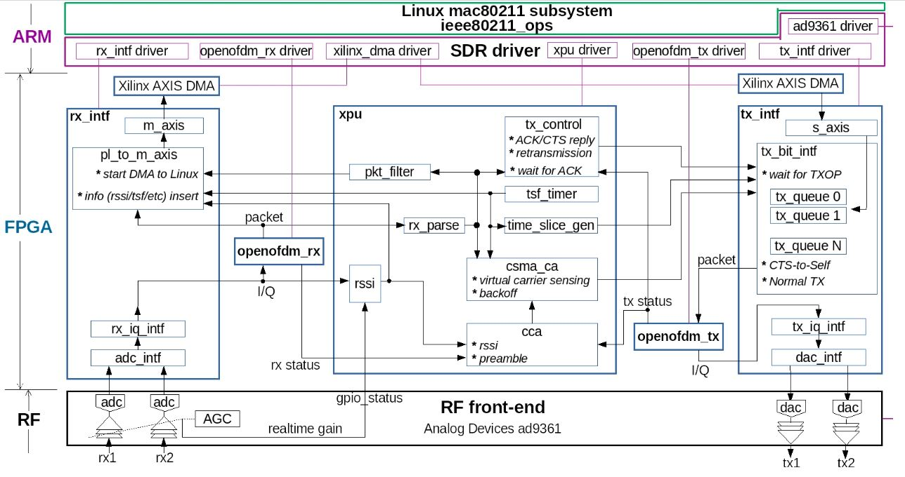

搞清楚多比特跨时钟域处理方法，fifo

接收机解调过程sync_long，
各种因素对csi计算的影响，最后该怎么对csi处理去噪相位纠正
axis协议传输csi
单路/两路如何提取信息
tx_bit_intf
跨时钟域传输

tcl脚本

意义：
无人机群远距离网络，机间链路协作，物理层，全双工CSMA/CA设计，动态路由协议
CSI感知，机上雷达，同感一体化

## wifi结构
;
从用户空间最后到sdr的驱动到FPGA分两条路，一路是应用数据进行系统调用，到套接字到网络协议，给设备接口，最后变成数据帧交给mac80211；
另一路是专门对wifi进行管理的工具，如wpa_supplicant,hostapd,iwconfig等，经linux内核空间nl80211、cfg80211协议栈，用户空间的请求通过netlink套接字传递给内核，nl80211是一个netlink协议，专为无线网络管理设计，将用户空间的请求转换为内核能够理解的格式。最后交给mac80211；
nl80211将请求传递给cfg80211,这是一个通用的无线网络配置框架，负责管理无线设备状态，处理WIFI设备的配置比如信道、频率等。
mac80211是实现80211MAC层的模块，处理所有与WIFI相关的协议逻辑，如帧的生成、发送和接收。
mac80211通过ieee80211_ops定义的函数接口api调用sdr.ko驱动，把各类数据和sdr交互，用sdr.ko控制整块fpga的工作。

openwifi属于softmac架构，管理、控制帧通过mac80211协议栈控制，lowmac的csma/ca、cca在fpga内部

;
数据从mac80211过来之后交给sdr驱动，sdr驱动调用rx_intf、openofdm_rx_driver、xilinx_dma_driver、xpu_driver、openofdm_tx_driver、tx_intf_driver等驱动对fpga控制；
sdr_driver数据先交给axis_dma，dma核和tx_intf RTL模块用axis总线相连，tx_intf进行队列管理等功能，收到来自XPU的可以发送、时间戳等标志和数据后把数据、发射参数交给PMD物理层发射机openofdm_tx，openofdm_tx进行物理层编码调制组帧后把数据交给tx_iq_intf和dac_intf最后交给ad9361发射。
ad9361实时接收电磁波后，经adc_intf和rx_iq_intf后得到IQ数据交给openofdm_rx接收机得到整个帧的结构和数据，把一系列参数交给pl_to_m_axis RTL模块用于处理mac80211需要的数据如rssi报告、时间戳报告、工作参数等信息；帧数据交给XPU模块，进行MAC帧解析，交给tx_control发射控制模块，交给csma_ca虚拟载波侦听和冲突避免模块，经过过滤把mac头信息交给pl_to_m_axis；
从ad9361获得实时agc增益对从IQ数据算得的rssi进行补偿，把实际的信号强度交给pl_to_m_axis和cca信道清除评估模块，物理上信道空闲后把标志位给csma模块。

### glossary:
RTS/CTS：request to send;clear to send，clear to send
cca(channel clear assessment)
nav(network allocation vector )，rts/cts机制，Nav不到0就挂起backoff倒数，由RTS/CTS和CP期除PSPOLL帧外的帧更新
BEB(binary exponential backoff)
backoff 回退，随机大小的竞争窗口，发送倒计时，只有在监听到信道空闲时才倒数，
PCF（point coordination function）
DCF(distributed coordination function)csma/ca必须实现
RA(received address)
TA(transmite address)

### MAC层帧结构

数据链路层分为LLC（Logical Link Control，逻辑链路控制）子层及MAC（Media Access Control，媒体访问控制）子层。上层数据被移交给LLC子层后成为MAC服务数据单元，即MSDU（MAC Service Data Unit），而当LLC将MSDU发送到MAC子层后，需要给MSDU增加MAC包头信息，被封装后的MSDU成为MAC协议数据单元，即MPDU（MAC Protocol Data Unit），其实它就是802.11MAC帧。802.11MAC帧包括第二层报头、帧主体及帧尾  

一般的MAC帧结构如图，FrameControl主要规定帧类型、分为管理帧、数据帧、控制帧，，控制帧用于控制对物理信道的占用，发送方向、帧聚合是否有更多分片、是否是重传帧、电源省电模式、缓存中是否有更多数据、是否用WEP加密、是否为数据帧。  

管理帧(management)用于AP/STA信标帧、接入、认证、连接等。分为连接(Association)请求和回应，重连(Reassociation)请求和回应，探测(Probe)请求和回应，时间同步帧(Timing Advertisement)，信标帧(Beacon)，ATIM(Announcement Traffic Indication Message)(IBSS网络中睡眠唤醒节能)，断连(Disassociation)、是/否授权(Authentication)、动作帧(Action)(协调同步网络节点间行为如频谱切换、同步定位等)，无需ACK的动作帧(Action-noACK)、保留帧(Reserved)  

控制帧(Control)用于控制对物理信道的占用，封装帧(Control Wrapper)封装多个其他类型的帧，块确认/块确认请求帧(Block Ack Request)，省电轮询(PowerSave-POLL)帧，RTS，CTS，ACK，无竞争结束(CF-END,Contension-Free-END)AP在PCF模式下控制其他STA的信道访问模式，优化无竞争期操作的复合控制帧(CF-END，CF-ACK)  
CF-END表示PCF功能结束，CF-ACK表示PCF下的ACK回复，CF-POLL表示PCF下的数据轮询

数据帧(Data)除正常数据帧外，也有类似的，在PCF下的Data + CF-Ack、Data+CF-end、 Data + CF-Ack + CF-Pol；带有Qos的数据帧(QoS Data)、在PCF下的(QoS Data + CF-Ack)等。

Duration/ID用于更新NAV向量，AID用于表示AP与STA之间的连接ID;  
Address：BSSID，Destination Adress，Source Adress，Reciever Adress，Transmitter Adress。不一定全都有。  
Qos表示数据包优先级  
HtControl表示对HT模式的一些控制  
FrameBody最大长度在不同版本下不同，80211a/g最大长度为2312，n最大长度为7951  
Sequence Control：分片序号和队列序号。
FCS：校验  

具体查看80211-2012-p480  
ProtocolVersion表示协议版本  
Tpye和Subtype规定帧类型，
To DS和From DS表示帧传输方向，把DS看作AP；00表示Station之间的AD Hoc类似的通信，或者控制侦、管理侦;01表示Sta接收的帧；10表示Sta发送的帧；11表示无线桥接器上的帧。  
在数据或管理帧中MoreFrag为1时表示之后还有更多分片，其他都为0  
Retry为1时表示在数据或管理帧中，这是一个重传帧，其他都为0
PowerManagement表示电量管理模式，在BSS和Mesh有不同的定义，见协议  
MoreData用于表示STA在PS模式是否有更多缓存数据等待传输，用于省电管理  
ProtectedFrame用于指示FrameBody是否经过密码学加密封装

特殊帧有具体的格式如CTS、RTS、ACK，如最重要的RTS、CTS、ACK。  

#################################
Qos、HT Control的详细解析
#################################

## wifi 具体工程结构

### sdr驱动
根据of_match_table匹配设备树匹配表，把驱动挂载在设备树对应的节点下。

### ps引出的接口
S_AXI_ACP接interconnect2 控制dma1，用于side_ch，数据采集

S_AXI_HP3接interconnect0 控制dma0，用于tx_intf,发射数据存储

M_AXI_GP0控axi_ad9361,axi_gpreg

M_AXI_GP1控主模块的七个IP核

### 时钟和数据速率
ps输出  FCLK_CLK0 100Mhz -ps_clk -xpu
        FCLK_CLK1 200Mhz -axi_ad9361_delayclk(7 series)
        FCLK_CLK2 125Mhz

axi_ad9361输入160MHZdata_clk,输出l_clk 160Mhz分频到40Mhz作为adc,dacIP核的时钟，输入主模块adc_clk
40Mhz倍频到100Mhz输入主模块m_axi_mm2s_aclk

openwifi主模块输入
ps_clk 100Mhz
adc_clk 40Mhz
m_axi_mm2s_aclk 100Mhz

## tx_intf
上层数据从dma0过来，s00_axis作为输入总线

### 输入输出接口
dac_rst:来自软核复位信号
dac_clk：40Mhz，来自axi_ad9361的L_clk经分频后形成adc_clk

### tx_intf_s_axis_i module
从s00_axis总线把数据从dma给过来；
例化4个xpm_fifo_sync用于存储数据队列，根据队列索引用于重传？
从连接到pl的dma读数据，dma另一头连接ps通过dma驱动和ps通信，dma和该模块实现pl和ps之间的通信
数据最后从DATA_TO_ACC输出

### tx_bit_intf_i module      xxxxxxxx复杂，待看
最关键的模块，控制交给物理发射机的MAC数据
数据经过（）判断选择后给到一个双端口xpm_memory_tdpram，1024×64大小,最后输出64位douta和64位数据data_to_acc，data_to_acc是最后传输的数据；最后交给openofdm_tx发射机。

### 两个 edge_to_flip module 
没用，只是led显示标志位，没有连接

### dac_intf module 
最后数据转换给ad9361

### tx_iq_intf module
输入发射机数据，经过选择和打包，是否选择随机数据，输出给dac的数据

### tx_status_fifo_i module
一些发射状态参数延时

### tx_interrupt_selection module
发射状态终端配置

## openofdm_tx  
主要就是dot11_tx模块根据状态机状态进行组帧
### 输入输出接口
(
  input  wire        clk,//100M 
  input  wire        phy_tx_arest,//fromPS输出FCLK2的复位信号

  input  wire        phy_tx_start,//from tx_intf的tx_bit_intf模块输出phy_tx_start
  output reg         phy_tx_done,//dot11，输出完一个物理帧
  output reg         phy_tx_started,//dot11，开始输出一个物理帧

  input  wire [6:0]  init_pilot_scram_state,
  input  wire [6:0]  init_data_scram_state,

  input  wire [63:0] bram_din,
  output reg  [9:0]  bram_addr,

  input  wire        result_iq_ready,
  output wire        result_iq_valid,
  output wire [15:0] result_i,//最后I路数据，交给tx_intf的tx_iq_intf
  output wire [15:0] result_q
);

state1：signal和ht_signal域组帧
state11：data域组帧
state2：加扰后的卷积、打孔、交织、导频插入和IFFT
state3：最后整个数据的输出

### 以state3描述
收到开始信号后从S3_WAIT_PKT状态进入S3_L_STF
输出用简单的查找表模块l_stf_rom，已转化为最后的16位i和q前导数据，发送160samples后进入S3_L_LTF
输出用简单的查找表模块l_ltf_rom，已转化为最后的16位i和q前导数据，发送160samples两个sym后进入S3_L_SIG

S3_L_SIG组帧：
以plcp_bit计数，取bram_din前[0:23]为signal域，设定对应发射参数，根据bram_din[24]判断PKT类型为LEGACY或HT(DATA service域头为0，HT signal头为1)，LEGACY则进入S1_DATA状态，HT则进入S1_HT_SIG，

## rx_intf

### adc_intf module
输入adc_data经过天线选择，是否屏蔽一路->adc_data_internal
经一个延时模块->adc_data_delay
经异步xpm fifo(写40Madc时钟，写使能20MHz,读100Mm_axis_clk)为100Mhz的data_to_acc_internal
经bb_gain，移位，把原本12位的9361数据符号扩展变为16位->ant_data_after_sel(data_to_bb)

判断是否选择本地回环，选择tx_intf数据和ant_data_after_sel,->bw20_i0,q0,i1,q1

### rx_iq_intf
已经进行旁路速率匹配->rf_i0_to_acc,
sample0 = {rf_i0_to_acc,rf_q0_to_acc}；作为接收数据
sample1 = {rf_i1_to_acc,rf_q1_to_acc}；仅作为采集数据

### byte_to_word_fcs_sn_insert module
input ofdm_rx接收机解析后的8位byte_out数据，转化为axis总线传输的64位数据

## ofdm_rx
### 信号
输入来自rx_intf的32位sample0作为IQ数据，经解析后输出8位byte_out和rx_intf的pl_to_m_axis模块和xpu的rx_parse模块

### dot11接收机状态机
S_WAIT_POWER_TRIGGER,等待rssi计算出的信号强度超过门限，进入S_SYNC_SHORT状态
其他状态下强度指示低于门限则都返回S_WAIT_POWER_TRIGGER状态，
S_SYNC_SHORT,捕获到到短训练序列，进入S_SYNC_LONG状态
S_SYNC_LONG,检测到长同步序列后进入S_DECODE_SIGNAL,处理sample个数大于320返回S_WAIT_POWER_TRIGGER,
S_DECODE_SIGNAL,24个bit后进入S_CHECK_SIGNAL
S_CHECK_SIGNAL校验SIGNAL位信息，错误则进入S_SIGNAL_ERROR，正确则根据rate字段是否为6M，进入S_DETECT_HT，或直接进入S_DECODE_DATA；
S_SIGNAL_ERROR复位后返回S_WAIT_POWER_TRIGGER
S_DETECT_HT如果是BPSK调制旋转后的星座图，进入S_HT_SIGNAL，正常调制则进入S_DECODE_DATA
S_HT_SIGNAL解调完成，各标志位完成，进入S_CHECK_HT_SIG_CRC
S_CHECK_HT_SIG_CRC若HT_SIGNAL_CRC校验正确，进入S_CHECK_HT_SIG，正确则
S_DECODE_DATA下进行数据位解包，解包完后若长度需要补充则送入S_MPDU_PAD，不需要则解包完成进入S_DECODE_DONE送入下一个帧的接收，进入S_WAIT_POWER_TRIGGER状态
有点麻烦，直接画流程图吧
经过校准后的rssi大于门限后进入sync_short状态,  

#### sync_short
捕获WIFI物理帧头，粗频偏估计
2个16位的IQsample信号sample_in[31:0]
complex_to_mag_sq   模块计算单个信号幅度平方(input,sample_in),结果truncate到(output)32位mag_sq[31:0]，即结果/2  
mag_sq_avg_inst     计算(16点)输入信号(input)mag_sq幅度平方平均mag_sq_avg[31:0]，默认3/4mag_sq_avg作为判决门限  
sample_delayed_inst 延迟16个采样点输出sample_delayed[31:0],计算复共轭sample_delayed_conj
delay_prod_inst     计算间隔16的点长的短训练序列(input,sample_in,sample_delayed_conj)相关值，输出prod[63:0],低位为I，截取了1/2，  
delay_prod_avg_inst     把(input)prod作16点平均，用于能量检测，输出prod_avg[63:0]
delay_prod_avg_mag_inst   (input)prod_avg转化为平均幅度,(output)delay_prod_avg_mag作为判断值，sqrt(i^2+q^2)，dsp trick ,Mag ~=Alpha*max(|I|,|Q|) + Beta*min(|I|,|Q|),感觉可以更新一下

freq_offset_inst    prod作64点平均，输出平均后的IQ值，用于频偏纠正，表示为夹角，进入phase_inst查找表输出-pi~pi的相位角后，进入sync_short后除以16，得到2pifT,四舍五入后，以负数输出

捕获到L_STF的条件:在平均自相关值大于能量检测门限后，个数超过100且正负数据个数都大于1/4

#### phase_inst
512位查找表查找0~pi/4范围，量化误差0.0878°
输入32位I、Q，输出[-pi,pi]量化到[-1608,1608]
sync_short阶段，从short输入2pi*f*16*T频偏查找角度后再次送入short四舍五入除以16得到2pifT并保持。

#### sync_long 
帧同步细检测，相位补偿，FFT变换

在dot11从检测到短同步序列后，跳转到sync_long，
在sync_long中每次输入送入dpram保存，更新地址，用于查找ltf开始地址，
首先S_SKIPPING掉L_STF的尾部(部分LTF的CP)，送入32点互相关器移位寄存存储，高位为最新数据，用8个复数乘法器乘4次算出32点和本地L_LTF的互相关值，找出峰值点地址存入addr1
S_WAIT_FOR_FIRST_PEAK:
数了88个后直接指示检测到L_LTF???

## xpu
### 信号物理参数
在 Linux 内核的 mac80211 子系统中，物理信号信息是通过 struct ieee80211_rx_status 结构体传递给 MAC 层的。以下是一些关键字段：

字段名	描述
signal	接收信号强度（RSSI），以 dBm 为单位。
snr	信噪比（SNR），以 dB 为单位。
freq	接收信号的频率。
rate	接收帧的速率信息（如 MCS 索引）。
flag	标志位，用于指示帧的状态（如是否成功接收、是否加密等）。
chains	接收天线链的信息（用于 MIMO）。
chain_signal	每个天线链的信号强度（用于 MIMO）。
rx_flags	接收帧的标志位（如是否使用短前导码）。

struct ieee80211_rx_status {
	u64 mactime;
	u64 boottime_ns;
	u32 device_timestamp;
	u32 ampdu_reference;
	u32 flag;
	u16 freq;
	u8 enc_flags;
	u8 encoding:2, bw:3;
	u8 rate_idx;
	u8 nss;
	u8 rx_flags;
	u8 band;
	u8 antenna;
	s8 signal;
	u8 chains;
	s8 chain_signal[IEEE80211_MAX_CHAINS];
	u8 ampdu_delimiter_crc;
};

### mac

不同状态下能够发送的MAC帧类型不同，例如state1下只能发送Class 1型帧。

;

Address 2, Address 3, Sequence Control, Address 4,和Frame Body字段只在某些帧中出现

Type(management,control,data)和Subtype字段共同决定MAC帧类型，To DS为1则表示帧发往DS(distributing system，即AP),From DS表示来自DS

duration表示 微秒

Address：
可能包含BSSID：一个按规则生成的46位随机数
DA(Destination Address),SA(Source Address),RA(Receiver Address),TA(Transmitter Address),

Sequence Control:
包含Sequence Number和Fragment Number，Sequence Number用12位标识MSDU序号，Fragment Number用4位标识MSDU单元中片段标号

FCS：
32位CRC

#### control frames
RTS帧

CTS帧

ACK帧

还有PS-Poll(Power-Save Poll)、CF-End(contension Free-End)、CF-ACK等等

#### data frames

#### management frames

有Beacon帧、IBSS ATIM帧(Announcement Traffic Indication Message)帧、Disassociation帧、Association Request、Association Response、Reassociation Request、Reassociation Response、Probe Request帧等等。

### 机制大概
csma/ca包括物理载波监听和虚拟载波监听，物理载波监听依靠cca实现，虚拟载波监听通过mac帧的nav字段实现

物理载波监听为空闲时，nav以slottime为单位回退，信道任意时刻为忙，nav暂停回退

### rssi
ad9361的实时agc_gain状态通过8个gpio_out的pins给到fpga，gpio_status_rf经rx_intf转换到rx_intf_bb基带时钟域信号
用采样得到的iq值计算iq_rssi_half_db，手动测试的增益correction,还有9361实时输出的gpio_status，
例子slv_reg57,
{gpio_status_delay[6:0],iq_rssi_half_db,1'b0,(~ch_idle_final),(tx_core_is_ongoing|tx_bb_is_ongoing|tx_rf_is_ongoing|cts_toself_rf_is_ongoing|ack_cts_is_ongoing), demod_is_ongoing,(~gpio_status_delay[7]),rssi_half_db};//rssi_half_db 11bit, iq_rssi_half_db 9bit
iq_rssi_half_db = 115;值
rssi_half_db_offset = 150;hardware_gain
gpio_status = 96;agc_control
实时的rssi_half_dB = 168
给出实时的校准rssi

rssi_half_db == 采样IQ计算iq_rssi_half_db - agc增益 + 不同频率下测量得到的ad9361偏移量校准

output rssi_half

### cca
比较接收信号强度和信号强度阈值，结合数据包的接收状态和发送状态，确定信道是否空闲
能量检测门限：rssi_half_db_th = 87<<1; // -62dBm
在解码有问题的时候等待7.5us,
assign ch_idle_rssi = (is_counting?1:( (rssi_half_db<=rssi_half_db_th) && (~demod_is_ongoing) ));
ch_idle = (ch_idle_rssi&&(~tx_rf_is_ongoing)&&(~cts_toself_rf_is_ongoing)&&(~ack_cts_is_ongoing))
在信号强度高于门限，解调不在运行、发射机射频不在运行、没有在发cts_toself、也没有在回应ACK时输出ch_idle表示信道空闲

### tx_on_detection
根据一些测量得到的最大延时如基带和射频之间传输的时延、射频关闭后，延长的时间、基带发射开始到发射通道开启、基带发射结束到发送通道关闭；还有openwifi模块内发射的一些状态；output一些指示发送状态的标志。
根据从tx_intf和tx模块输入的发射接收状态标志信号，驱动输入的延时，输出一些状态标志信号
tx_core_is_ongoing，tx模块正在进行，change 1st
tx_bb_is_ongoing，tx_intf正在进行，数据已经给到tx_iq_intf的fifo，2nd
tx_rf_is_ongoing，rf已经进行时，手动设置延时确定标志位，4th
tx_chain_on，bb状态和手动设置延时，确定给9361的状态切换spi写入标志，3rd

### cw_exp
input来自tx_bit_intf的tx_queue_idx不同后更新cw窗口长度
if队列索引不同、尝试发送完成、退出重传等条件重置cw窗口至最小，
    else {if重传触发并且小于最大窗口时
        cw_exp+1
        else
        cw_exp保持不变
        }

