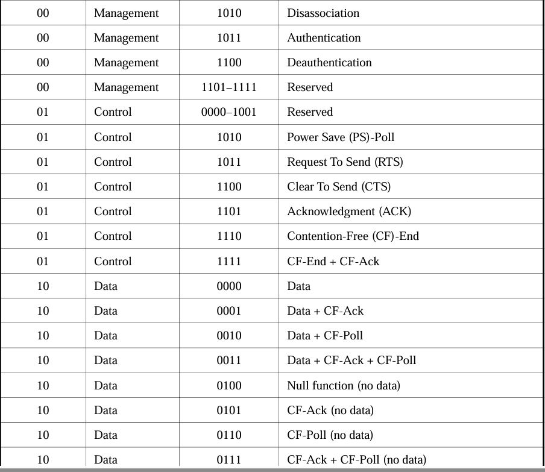
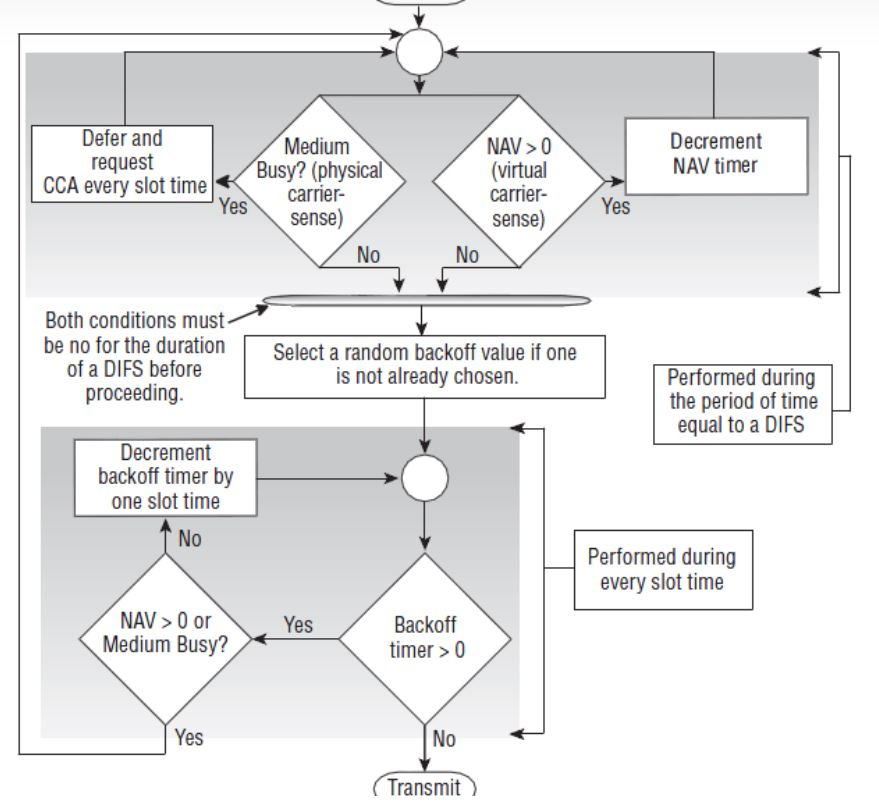

## csma/ca 
80211-2012,9.2,9.3
80211-2012,362页,各种延时、切换、时间原语定义
80211-2012,843页，IFS之间计算和关系

a) RIFS reduced interframe space    最小帧间间隔，只有两个站
b) SIFS short interframe space  多站允许的最小帧间间隔，空口接收最后一个符号，到处理并最早给出响应帧物理头的最短间隔
c) PIFS PCF interframe space
d) DIFS DCF interframe space
e) AIFS arbitration interframe space (used by the QoS facility)
f) EIFS extended interframe space

csma/ca包括物理载波监听和虚拟载波监听，物理载波监听依靠cca实现，虚拟载波监听通过mac帧的nav字段实现

;

CTS/RTS不是每帧都需要建立连接，对于过短数据长度的帧可能没有rts/cts建立，该机制可以在dot11RTSThreshold attribute设为always、never、or 超过length threshold
CTS/RTS帧，在duration字段包含传输和ACK所的占用信道时间(us)，可以被所有sta接收，用来更新每个sta的nav长度，

sifs = aRXRFDelay（射频延迟）＋aRXPLCPDelay（物理层头部接收延迟）＋aMACProcessingDelay（MAC层处理延迟） + aRxTxTurnaroundTime（发送接收天线转换时间）
slot = 可以理解成竞争过程Backoff的最小时间间隔，其包含aCCATime（CCA时间）＋aRxTxTurnaroundTime（发送接收天线转换时间）＋aAirPropagationTime（传播延迟）＋aMACProcessingDelay（MAC层处理延迟）。20us
pifs = sifs + 1*slot
difs = sifs + 2*slot,其本质上实际上都是最基本的SIFS和Slot的一个组合。

主要分为nav的倒数和重设

## cca module (channel assesment clear)
包括能量检测和载波监听，能量检测即根据rssi判断，载波监听用是否检测到前导训练符号判断
能量检测门限：rssi_half_db_th = 87<<1; // -62dBm
前导序列成功检测：检测到短长训练序列
其他一些控制信号
输出ch_idle表示信道空闲

## tsf_timer(time syc function)
产生一个周期为1us，占空比为1%的小脉冲tsf_pulse_1M,
从linux给出一个64位的标准时间，并以1us的速度计数,猜测为系统之间同步的信息。radio tap header?

## time_slice_gen
给出四个队列的使能

# rssi module
用采样得到的iq值计算iq_rssi_half_db，手动测试的增益correction,还有9361实时输出的gpio_status，
例子slv_reg57,
{gpio_status_delay[6:0],iq_rssi_half_db,1'b0,(~ch_idle_final),(tx_core_is_ongoing|tx_bb_is_ongoing|tx_rf_is_ongoing|cts_toself_rf_is_ongoing|ack_cts_is_ongoing), demod_is_ongoing,(~gpio_status_delay[7]),rssi_half_db};//rssi_half_db 11bit, iq_rssi_half_db 9bit
iq_rssi_half_db = 115;值
rssi_half_db_offset = 150;hardware_gain
gpio_status = 96;agc_control
实时的rssi_half_dB = 168
给出实时的校准rssi

rssi_half_db == 采样IQ计算iq_rssi_half_db - agc增益 + 不同频率下测量得到的ad9361偏移量校准

## phy_rx_parse
物理帧解析，分辨ack帧和地址
2Byte framecontrol + 2Byte Duration/ID + 6Byte rx_addr +6Byte tx_addr 固定
若为控制帧的block ack request 
    2Byte blk_ack_req_control +2Byte blk_ack_req_ssc
若为控制帧的block ack 
    空2Byte +2Byte blk_ack_req_ssn +8Byte blk_ack_resp_bitmap
else 
    2Byte sequence control 
        若(to DS,from DS = 2b'11)
        +6Byte src_addr
    2Byte Qos
end

## pkt_filter_ctl
过滤某些管理帧和控制帧，因为在fpga部分可以实现low mac的csma，部分帧不需要交给上层mac80211处理
输出block_rx_dma_to_ps信号决定帧是否交给rx_intf再给dma给到上层
monitor模式下可能会改变frame filter的规则，通过sdr驱动改变标志位改变mac80211状态，同时改变fpga过滤状态

需要配合linux的mac80211协议栈和mac帧结构同时看

## spi module 
控制ad9361的收发模式切换，物理上9361在fdd模式，通过写24bit的指令控制本振分频器的开关，
实现快速切换的tdd工作模式，
ps选用SPI0_SCLK_O，SPI0_MOSI_O,SPI0_MISO_I(直连9361),SPI0_SS_O，其他连到xpu？？？
软核把输出信号给到openwifi_module spi0_csn,spi0_sclk,spi0_mosi，经过spi处理选择后给到ad9361；

## cw_exp module (contention window)
给出cw_exp
if不同队列之间、完成发送、重传退出等条件重置cw窗口至最小，
    else {if重传触发并且小于最大窗口时
        cw_exp+1
        else
        cw_exp保持不变
        }

## tx_control(关键)
管理发送、重传、ACK

## tx_on_detection
根据从tx_intf和tx模块输入的发射接收状态标志信号，驱动输入的延时，输出一些状态标志信号
tx_core_is_ongoing，tx模块正在进行，change 1st
tx_bb_is_ongoing，tx_intf正在进行，数据已经给到tx_iq_intf的fifo，2nd
tx_rf_is_ongoing，rf已经进行时，手动设置延时确定标志位，4th
tx_chain_on，bb状态和手动设置延时，确定给9361的状态切换标志，3rd

## csma/ca module(关键)

